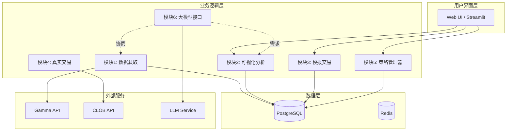
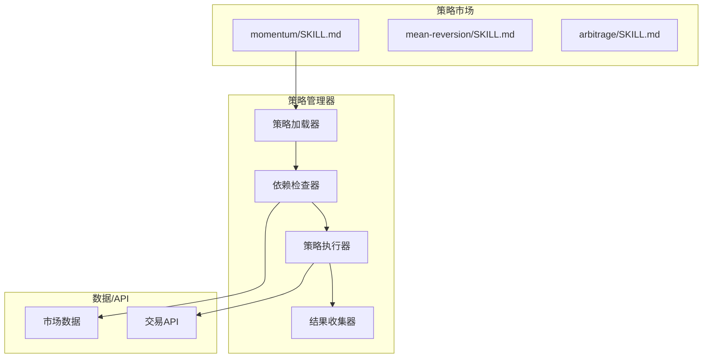
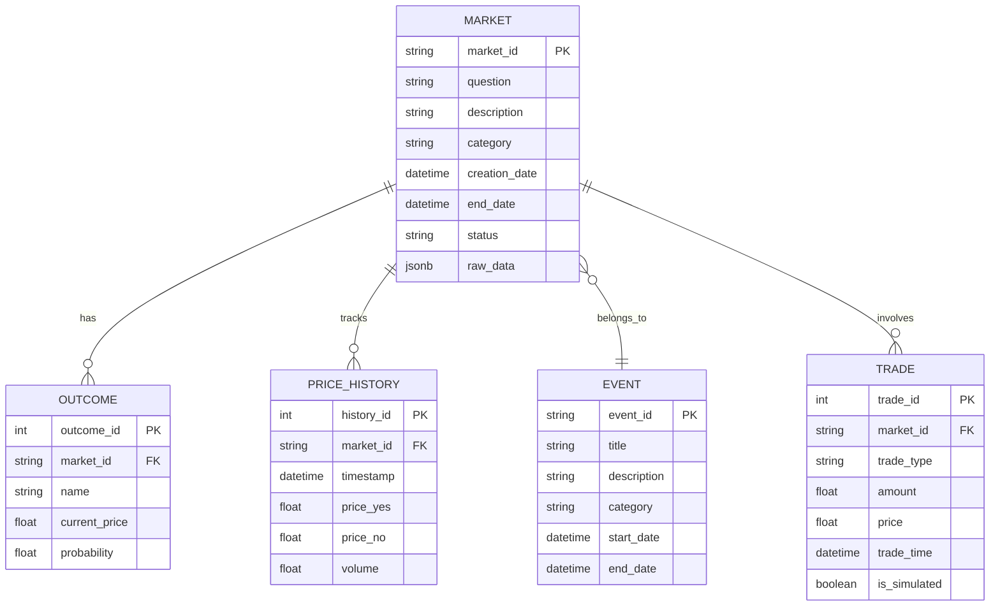

# PolyOMB 项目讨论记录

> 记录顾问角色与用户的讨论过程及设计决策

---

## 📅 讨论信息

- **日期**: 2026-02-15
- **参与者**: 用户 + 顾问角色 (Kimi)
- **主题**: PolyOMB 软件架构设计
- **状态**: 进行中

---

## 🎯 项目概述

**PolyOMB** = Polymarket 自动化交易 + 历史数据分析平台

**目标用户**: 对预测市场感兴趣但不一定有代码基础的用户

---

## 💡 需求收集过程

### 背景
用户已有一定基础：
- 在 `CodeLib/00019` 文件夹中有 Polymarket API 测试代码
- 熟悉 Gamma API 的基本调用
- 面临 API 不规整、字段变化的问题

### 核心需求（逐条收集）

| 模块 | 需求描述 | 优先级 |
|------|---------|--------|
| **数据获取** | 从 Polymarket API 获取数据，解决 API 不规整问题 | P0 |
| **可视化分析** | 展示数据，支持自定义可视化需求 | P0 |
| **模拟交易** | 虚拟资金模拟交易，跟踪盈亏 | P1 |
| **真实交易** | 与 Polymarket 真实交互（第二阶段） | P2 |
| **策略管理器** | 管理交易策略，类似 OpenClaw 的 Skill 系统 | P1 |
| **大模型接口** | 处理灵活需求，协调各模块 | P1 |

### 特殊场景

**场景1：自定义可视化需求处理**
```
用户提出特制需求
    ↓
大模型接口分析需求 → 确定所需数据字段
    ↓
检查现有数据库 → 缺失？
    ↓          ↓
  完整         与数据获取模块沟通
    ↓              ↓
数据获取模块执行爬取
    ↓
验证数据完整性
    ↓
可视化模块展示
```

**具体案例**：政治类 Market 成功率时间线可视化
- 查询：2025年所有政治类 market
- 分析：成功率从50%→60%→70%→80%→90%→100%各阶段耗时
- 可视化：彩虹时间线（红橙黄绿青），按时间比例拉伸
- 展示：1000个 market 排列成热图

---

## 🔍 参考案例调研

### PolyClaw (chainstacklabs/polyclaw)

**架构**：
- Gamma API Client
- Wallet 管理
- Trade 执行（Split + CLOB）
- Position 跟踪
- LLM Hedge 发现

**可借鉴**：
- 模块化 Skill 设计
- 本地 JSON 仓位存储
- LLM 驱动的策略发现

### OpenClaw (用户本地 CodeLib/00020 文件夹)

**核心架构**：
```
用户界面 → OpenClaw 网关 → Skill 系统 → 外部服务
```

**Skill 机制**：
- SKILL.md 定义接口
- frontmatter 声明依赖
- 动态加载和执行
- LLM 驱动选择和调用

**PolyOMB 应用**：
- 策略即 Skill
- 统一策略接口
- 社区策略分享

---

## 🏗️ 架构设计

### 整体架构



### 策略管理器设计（基于 OpenClaw）



### 策略 Skill 格式示例

```yaml
---
name: momentum-strategy
description: "基于价格动量的交易策略"
metadata:
  polyomb:
    emoji: "📈"
    requires:
      data: ["price_history", "volume"]
      apis: ["gamma"]
    params:
      - name: "lookback_period"
        type: "int"
        default: 14
---

## 策略逻辑
1. 计算过去 N 天的价格变化率
2. 如果变化率 > threshold，买入 YES
3. 如果变化率 < -threshold，买入 NO

## 风险控制
- 单笔最大仓位: 10%
- 止损线: -20%
```

---

## 📊 数据库设计概览



---

## 🛠️ 技术选型建议

| 组件 | 推荐方案 | 理由 |
|------|---------|------|
| 后端 | Python + FastAPI | 快速开发，异步支持 |
| 数据库 | PostgreSQL | JSONB 支持，复杂查询 |
| 缓存 | Redis | 高频数据缓存 |
| 可视化 | Streamlit / Plotly | 快速原型，交互性强 |
| 任务队列 | Celery + Redis | 异步数据处理 |
| LLM 接口 | LiteLLM | 统一接口，多模型支持 |

---

## 🗺️ 开发路线图

### Phase 1: MVP (4-6周)
- 模块1: 数据获取 + 数据库存储
- 模块2: 基础可视化

### Phase 2: 核心功能 (4-6周)
- 模块3: 模拟交易
- 模块5: 策略管理器
- 基础回测

### Phase 3: 智能功能 (4-6周)
- 模块6: 大模型接口
- 高级可视化（场景1）
- 策略市场

### Phase 4: 生产就绪 (待定)
- 模块4: 真实交易
- 性能优化
- 安全加固

---

## 📁 相关文件

| 文件 | 说明 |
|------|------|
| `polyomb_design_draft.md` | 完整设计方案草案 |
| `CodeLib/00019/Polymarket Quantitative Trading/` | 用户现有代码 |
| `CodeLib/00020/` | OpenClaw 源码参考 |

---

## ❓ 待确认问题

1. 数据库选型：PostgreSQL 是否满意？
2. UI 框架：Streamlit 合适吗？
3. LLM 模型：OpenAI/Claude/本地？
4. 是否需要 OpenClaw 更深入集成？

---

## 📝 讨论模式说明

本次讨论采用顾问角色的**分段输入模式**：
- 用户：逐条提供需求信息
- 顾问：回应"了解，还有呢？"（内部记录整理）
- 触发：用户问"你有什么看法"时统一输出完整方案

---

*记录更新时间: 2026-02-15*
