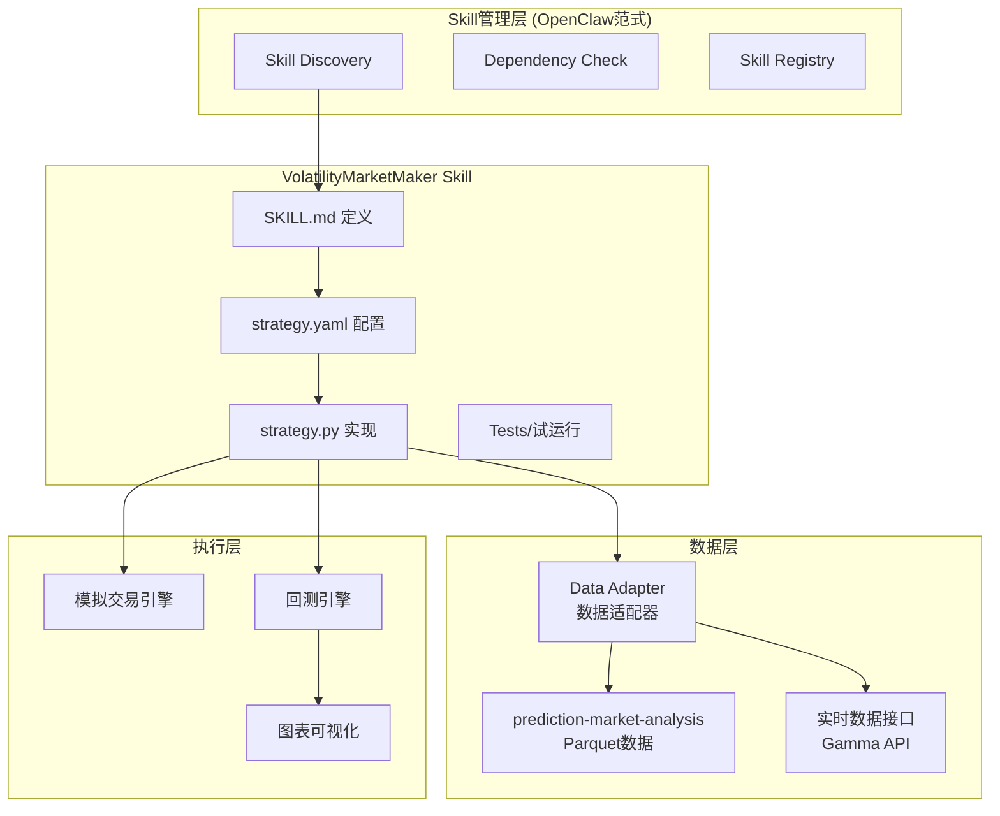
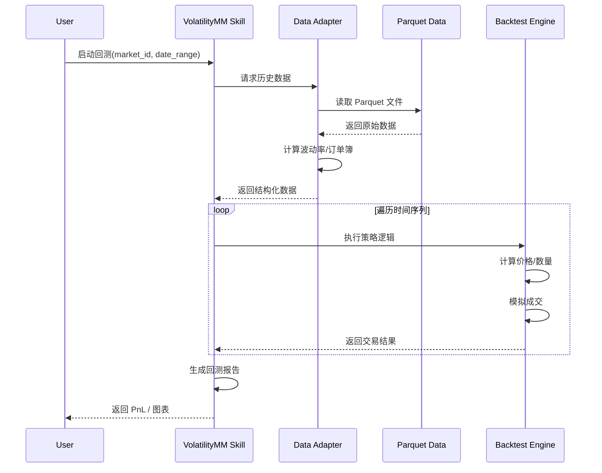
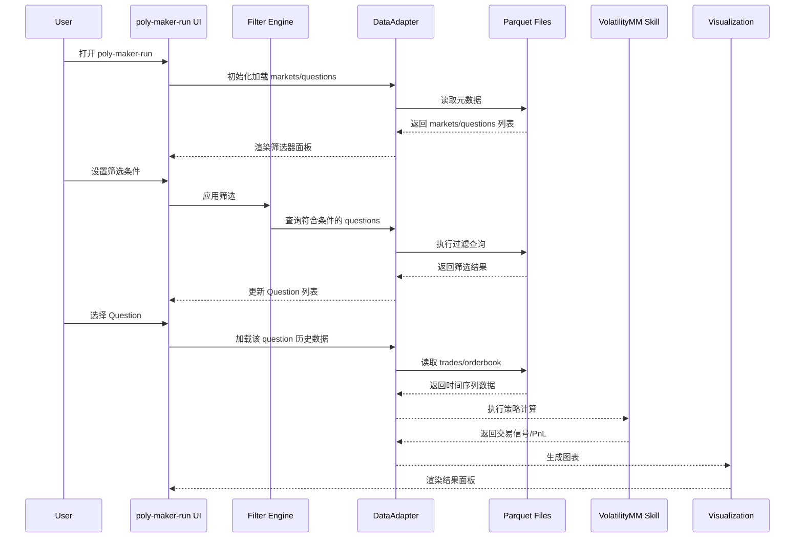
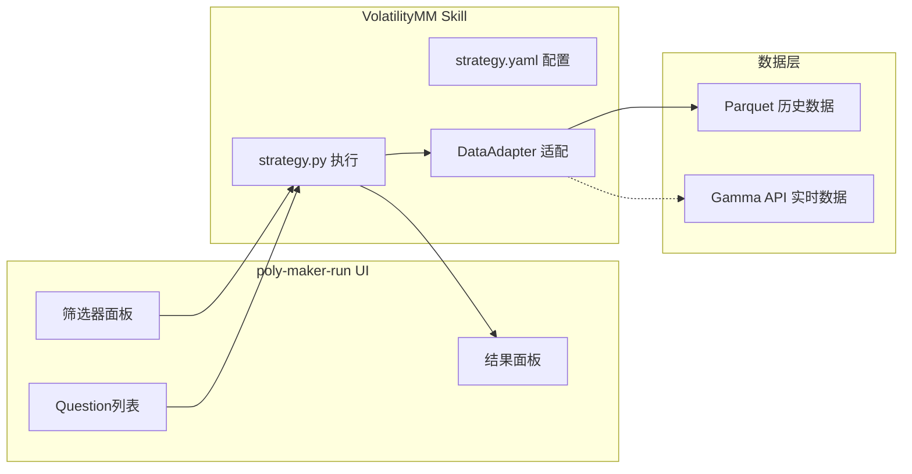

# A0012 VolatilityMarketMaker Skill 架构规划

> 架构师角色 | 日期：2026-02-17

---

## 📋 规划概览

### 目标
创建一个基于 poly-maker 核心算法的 PolyOMB Skill，实现：
1. **核心算法**: 移植 poly-maker 的波动率做市策略
2. **数据源**: 对接本地 prediction-market-analysis 历史数据
3. **管理方式**: 采用 OpenClaw Skill 系统的技术栈和界面范式

### 产出物
本规划确认后，将生成：
- `00002_volatility_market_maker/` 策略文件夹
- SKILL.md (OpenClaw 格式) + strategy.yaml (PolyOMB 格式)
- strategy.py (核心算法实现)
- 说明文档

---

## 🏗️ 架构设计

### 1. 整体架构图



### 2. 文件结构规划

```
PolyOMB_Skills/
└── 00002_volatility_market_maker/
    ├── 00002_SKILL.md                    # OpenClaw 格式 Skill 定义
    ├── 00002_strategy.yaml               # PolyOMB 策略配置
    ├── 00002_strategy.py                 # 策略核心实现
    ├── 00002_adapter.py                  # 数据适配器
    ├── 00002_backtest.py                 # 回测引擎封装
    ├── 00002_volatility_market_maker.description.md  # 说明文档
    └── tests/
        ├── test_volatility_calc.py       # 波动率计算测试
        ├── test_order_pricing.py         # 订单定价测试
        └── test_integration.py           # 集成测试
```

---

## 🔧 核心设计决策

### 决策 1: 双格式配置兼容

| 格式 | 用途 | 优先级 |
|------|------|--------|
| SKILL.md (OpenClaw) | Skill 发现、依赖声明、LLM 提示 | 主要 |
| strategy.yaml (PolyOMB) | 运行时配置、参数管理 | 次要 |

**理由**: 兼容 OpenClaw 生态，同时满足 PolyOMB 运行时需求。

### 决策 2: 数据适配器模式

```python
class PredictionMarketDataAdapter:
    """
    适配 prediction-market-analysis 的 Parquet 数据
    转换为 poly-maker 期望的数据格式
    """
    
    def load_market_data(self, market_id: str) -> pd.DataFrame:
        """从 Parquet 加载市场历史数据"""
        pass
    
    def calculate_volatility(self, df: pd.DataFrame, window: str = "3h") -> float:
        """计算 N 小时波动率"""
        pass
    
    def get_order_book_snapshot(self, market_id: str, timestamp: datetime) -> dict:
        """获取特定时间点的订单簿快照"""
        pass
```

**理由**: 隔离数据源变化，便于后续切换到实时 API。

### 决策 3: 策略执行模式

| 模式 | 用途 | 实现方式 |
|------|------|----------|
| **Backtest 模式** | 历史数据回测 | 遍历历史数据，模拟执行 |
| **Paper 模式** | 模拟交易 | 连接模拟账户，虚拟资金 |
| **Live 模式** | 真实交易 | 连接真实 API（Phase 4） |

**理由**: 支持渐进式验证，从回测到实盘。

---

## 📊 数据流设计

### 历史数据回测流程



### 数据结构映射

| poly-maker 原字段 | prediction-market-analysis 来源 | 计算方式 |
|------------------|-------------------------------|----------|
| `3_hour` (波动率) | trades.parquet | 3小时价格变化率标准差 |
| `best_bid` | order book snapshot | 最高买单价格 |
| `best_ask` | order book snapshot | 最低卖单价格 |
| `mid_price` | calculated | (best_bid + best_ask) / 2 |
| `tick_size` | markets.parquet | 市场配置 |

---

## 🎨 界面设计 (OpenClaw 范式)

### Skill 管理界面规划

参考 OpenClaw 的 Skill 管理，设计以下界面：

```
┌─────────────────────────────────────────────────────────────┐
│  PolyOMB Skill Manager                                       │
├─────────────────────────────────────────────────────────────┤
│  ┌─────────────────────────────────────────────────────┐   │
│  │  已安装 Skills                                       │   │
│  │  ┌──────────────┐ ┌──────────────┐ ┌──────────────┐  │   │
│  │  │ 📈 Volatility│ │ 📉 MeanRev   │ │ ⚖️ Arbitrage │  │   │
│  │  │   MarketMaker│ │              │ │              │  │   │
│  │  │  [运行] [配置]│ │  [运行] [配置]│ │  [安装]      │  │   │
│  │  └──────────────┘ └──────────────┘ └──────────────┘  │   │
│  └─────────────────────────────────────────────────────┘   │
│                                                             │
│  ┌─────────────────────────────────────────────────────┐   │
│  │  VolatilityMarketMaker 详情                          │   │
│  │  ─────────────────────────────────────────────────  │   │
│  │  状态: ✅ 依赖满足                                    │   │
│  │  版本: 1.0.0                                         │   │
│  │  作者: PolyOMB Team                                  │   │
│  │                                                      │   │
│  │  [▶️ 运行回测] [📊 查看结果] [⚙️ 参数配置]            │   │
│  └─────────────────────────────────────────────────────┘   │
└─────────────────────────────────────────────────────────────┘
```

---

## 🖥️ Poly-Maker-Run 核心界面设计

### 界面概览

**界面名称**: `poly-maker-run`  
**布局**: 全屏三列响应式布局  
**技术栈**: Streamlit (参考 Gnosis Agent 实现) + Plotly 图表

```
┌─────────────────────────────────────────────────────────────────────────────────────────────┐
│  🔷 Poly-Maker-Run - Volatility Market Maker Analysis                          [全屏切换] │
├─────────────────────────────────────────────────────────────────────────────────────────────┤
│                                                                                             │
│  ┌──────────────────────┐  ┌──────────────────────────────┐  ┌──────────────────────────┐  │
│  │    📊 筛选器         │  │    📋 Question 列表          │  │    📈 分析结果            │  │
│  │    (Filter Panel)    │  │    (Question List)           │  │    (Results Panel)       │  │
│  │    宽度: 20%         │  │    宽度: 30%                 │  │    宽度: 50%             │  │
│  │                      │  │                              │  │                          │  │
│  ├──────────────────────┤  │                              │  │                          │  │
│  │ 1️⃣ 数据源            │  │ ┌──────────────────────────┐ │  │ 当选择左侧 Question 时   │  │
│  │                      │  │ │ 🔍 搜索 questions...     │ │  │ 实时显示 Skill 计算结果  │  │
│  │ ○ Historical Data    │  │ └──────────────────────────┘ │  │                          │  │
│  │   (Parquet)          │  │                              │  │ ┌──────────────────────┐ │  │
│  │ ● 已选中            │  │ ┌──────────────────────────┐ │  │ │  📊 价格波动图表      │ │  │
│  │                      │  │ │ ✅ Will Trump win 2024?  │ │  │ │  - 历史价格走势       │ │  │
│  │ ○ Real-time API      │  │ │    [2024 Politics]       │ │  │ │  - 买卖挂单深度       │ │  │
│  │   (Gamma)            │  │ │    • Yes: 0.65 • No: 0.35│ │  │ │  - 成交标记          │ │  │
│  │   [未来可用]         │  │ │    [选择并运行分析]      │ │  │ └──────────────────────┘ │  │
│  │                      │  │ └──────────────────────────┘ │  │                          │  │
│  ├──────────────────────┤  │                              │  │ ┌──────────────────────┐ │  │
│  │ 2️⃣ Market 筛选       │  │ ┌──────────────────────────┐ │  │ │  📈 策略信号图表      │ │  │
│  │                      │  │ │ ☐ Will ETH reach $5k?    │ │  │ │  - 买入/卖出信号      │ │  │
│  │ ☑ 2024 Politics      │  │ │    [Crypto]              │ │  │ │  - 持仓变化          │ │  │
│  │ ☑ Crypto             │  │ │    • Yes: 0.42 • No: 0.58│ │  │ │  - PnL 曲线          │ │  │
│  │ ☐ Sports             │  │ └──────────────────────────┘ │  │ └──────────────────────┘ │  │
│  │ ☑ Tech               │  │                              │  │                          │  │
│  │                      │  │ ... (更多 questions)        │  │ ┌──────────────────────┐ │  │
│  ├──────────────────────┤  │                              │  │ │  📋 交易记录表格      │ │  │
│  │ 3️⃣ Question 筛选     │  └──────────────────────────────┘  │ │  - 时间/价格/类型/数量│ │  │
│  │                      │                                     │ │  - 累计盈亏          │ │  │
│  │ [搜索...           ] │                                     │ └──────────────────────┘ │  │
│  │                      │                                     │                          │  │
│  │ 热门 Tags:           │                                     │ ┌──────────────────────┐ │  │
│  │ [#Trump] [#BTC]     │                                     │ │  ⚙️ 策略参数面板      │ │  │
│  │ [#Election] [#AI]   │                                     │ │  - 止损: -5%         │ │  │
│  │                      │                                     │ │  - 止盈: +3%         │ │  │
│  ├──────────────────────┤                                     │ │  - 波动率阈值: 0.15  │ │  │
│  │ 4️⃣ Outcome 筛选      │                                     │ │  [修改参数] [重跑]   │ │  │
│  │                      │                                     │ └──────────────────────┘ │  │
│  │ ☑ Yes / Long         │                                     │                          │  │
│  │ ☑ No / Short         │                                     │ ┌──────────────────────┐ │  │
│  │                      │                                     │ │  📊 统计指标          │ │  │
│  │ 高级: 多选具体选项   │                                     │ │  - 总收益率: +12.5%  │ │  │
│  │ [展开 ▼]            │                                     │ │  - 夏普比率: 1.85    │ │  │
│  │                      │                                     │ │  - 最大回撤: -8.2%   │ │  │
│  ├──────────────────────┤                                     │ │  - 胜率: 68%         │ │  │
│  │ 5️⃣ 时间周期          │                                     │ └──────────────────────┘ │  │
│  │                      │                                     │                          │  │
│  │ ○ 全生命周期         │                                     │                          │  │
│  │ ● 自定义区间         │                                     │                          │  │
│  │                      │                                     │                          │  │
│  │ 开始: [2024-01-01]  │                                     │                          │  │
│  │ 结束: [2024-12-31]  │                                     │                          │  │
│  │                      │                                     │                          │  │
│  │ 预设:               │                                     │                          │  │
│  │ [近7天] [近30天]    │                                     │                          │  │
│  │ [本季度] [全年]     │                                     │                          │  │
│  │ [生命周期]          │                                     │                          │  │
│  │                      │                                     │                          │  │
│  ├──────────────────────┤                                     │                          │  │
│  │ [🔄 应用筛选]        │                                     │                          │  │
│  │ [重置]               │                                     │                          │  │
│  └──────────────────────┘                                     └──────────────────────────┘  │
│                                                                                             │
└─────────────────────────────────────────────────────────────────────────────────────────────┘
```

---

### 组件详细设计

#### 左列：筛选器面板 (20%)

| 组件 | 类型 | 功能 | 数据来源 |
|------|------|------|----------|
| **数据源选择** | Radio Button | 切换 Historical/Realtime | 硬编码，Realtime 标记为"[未来可用]" |
| **Market 多选** | Checkbox Group | 按市场类别筛选 | 从 Parquet 读取 market 表 categories |
| **Question 搜索** | Search Input + Tags | 关键词搜索 + 热门标签 | 从 Parquet 读取 question 表 |
| **Outcome 筛选** | Checkbox + Dropdown | Yes/No 或具体选项 | 根据 question 动态加载 outcomes |
| **时间周期** | Radio + Date Picker + Presets | 生命周期/全年/自定义区间 | 用户输入，自动识别数据年份 |
| **操作按钮** | Button Group | 应用筛选 / 重置 | - |

**时间周期预设逻辑**:
```python
class TimeRangePreset(Enum):
    LAST_7_DAYS = "近7天"
    LAST_30_DAYS = "近30天"
    THIS_QUARTER = "本季度"
    FULL_YEAR = "全年"  # 自动根据市场数据年份决定
    FULL_LIFECYCLE = "生命周期"  # 该 question 的全部历史数据

def get_date_range(preset: TimeRangePreset, market_data: pd.DataFrame) -> Tuple[datetime, datetime]:
    \"\"\"根据预设返回开始和结束日期\"\"\"
    now = datetime.now()
    
    if preset == TimeRangePreset.LAST_7_DAYS:
        return now - timedelta(days=7), now
    elif preset == TimeRangePreset.LAST_30_DAYS:
        return now - timedelta(days=30), now
    elif preset == TimeRangePreset.THIS_QUARTER:
        quarter_start = datetime(now.year, (now.month - 1) // 3 * 3 + 1, 1)
        return quarter_start, now
    elif preset == TimeRangePreset.FULL_YEAR:
        # 自动检测市场数据的年份
        data_year = market_data['timestamp'].dt.year.mode()[0]  # 取众数年份
        return datetime(data_year, 1, 1), datetime(data_year, 12, 31)
    elif preset == TimeRangePreset.FULL_LIFECYCLE:
        # 使用该 question 的全部历史数据
        return market_data['timestamp'].min(), market_data['timestamp'].max()
```

**筛选器状态管理**:
```python
@dataclass
class FilterState:
    data_source: Literal["historical", "realtime"] = "historical"
    selected_markets: List[str] = field(default_factory=list)
    search_query: str = ""
    selected_tags: List[str] = field(default_factory=list)
    selected_outcomes: List[str] = field(default_factory=lambda: ["Yes", "No"])
    time_mode: Literal["full", "custom"] = "full"
    start_date: Optional[datetime] = None
    end_date: Optional[datetime] = None
```

#### 中列：Question 列表 (35%)

| 组件 | 类型 | 功能 |
|------|------|------|
| **搜索框** | Text Input | 在已筛选结果中快速搜索 |
| **Question 卡片** | Expandable Card | 显示 question 基本信息 |
| **选择按钮** | Button | 选中该 question 进行分析 |
| **多选支持** | Checkbox | 批量选择多个 questions |
| **排序选项** | Select | 按流动性/时间/名称排序 |

**Question 卡片结构**:
```
┌────────────────────────────────┐
│ ✅ Question Title              │
│    [Market Category]           │
│    • Outcome1: 0.65           │
│    • Outcome2: 0.35           │
│    流动性: $1.2M | 24h成交: 500│
│    [🔍 选择并分析]             │
└────────────────────────────────┘
```

#### 右列：分析结果面板 (40%)

| 组件 | 类型 | 功能 | 交互 |
|------|------|------|------|
| **价格图表** | Plotly Chart | 历史价格走势 + 订单簿深度 | 缩放/平移/悬停详情 |
| **策略信号图** | Plotly Chart | 买入/卖出信号标记 + PnL | 与价格图联动 |
| **交易记录表** | DataFrame Table | 完整交易历史 | 分页/排序/导出 CSV |
| **参数面板** | Form | 调整策略参数 | 实时重算 |
| **统计指标** | Metric Cards | 关键绩效指标 | 自动更新 |

---

### 数据流设计



---

### 技术实现方案

#### Streamlit 布局代码结构

```python
import streamlit as st
import plotly.graph_objects as go
from plotly.subplots import make_subplots

# 页面配置
st.set_page_config(
    page_title="Poly-Maker-Run",
    layout="wide",  # 全屏宽布局
    initial_sidebar_state="collapsed"
)

# 自定义 CSS 实现三列固定比例
st.markdown("""
<style>
    .main .block-container {
        max-width: 100%;
        padding: 0;
    }
    .filter-column {
        background-color: #f8f9fa;
        padding: 1rem;
        border-right: 1px solid #dee2e6;
        height: 100vh;
        overflow-y: auto;
    }
    .question-column {
        background-color: #ffffff;
        padding: 1rem;
        border-right: 1px solid #dee2e6;
        height: 100vh;
        overflow-y: auto;
    }
    .result-column {
        background-color: #ffffff;
        padding: 1rem;
        height: 100vh;
        overflow-y: auto;
    }
</style>
""", unsafe_allow_html=True)

# 三列布局 (20% - 30% - 50%)
col_filter, col_question, col_result = st.columns([0.20, 0.30, 0.50])

# 左列：筛选器
with col_filter:
    st.markdown("<div class='filter-column'>", unsafe_allow_html=True)
    render_filter_panel()
    st.markdown("</div>", unsafe_allow_html=True)

# 中列：Question 列表
with col_question:
    st.markdown("<div class='question-column'>", unsafe_allow_html=True)
    render_question_list()
    st.markdown("</div>", unsafe_allow_html=True)

# 右列：分析结果
with col_result:
    st.markdown("<div class='result-column'>", unsafe_allow_html=True)
    render_result_panel()
    st.markdown("</div>", unsafe_allow_html=True)
```

#### 关键组件实现

**1. 筛选器状态管理 (Session State)**
```python
# 初始化筛选器状态
if 'filters' not in st.session_state:
    st.session_state.filters = FilterState()

# 数据源选择
data_source = st.radio(
    "📊 数据源",
    options=["historical", "realtime"],
    format_func=lambda x: {
        "historical": "📁 Historical Data (Parquet)",
        "realtime": "🌐 Real-time API (Gamma) [未来可用]"
    }[x],
    key="data_source"
)
```

**2. Question 卡片组件**
```python
def render_question_card(question: QuestionMeta):
    """渲染单个 Question 卡片"""
    with st.container():
        col1, col2 = st.columns([0.8, 0.2])
        with col1:
            st.markdown(f"**{question.title}**")
            st.caption(f"[{question.category}] 流动性: ${question.liquidity:,.0f}")
            # Outcomes 价格
            for outcome in question.outcomes:
                st.markdown(f"• {outcome.name}: {outcome.price:.2f}")
        with col2:
            if st.button("🔍 分析", key=f"btn_{question.id}"):
                st.session_state.selected_question = question
                st.rerun()
        st.divider()
```

**3. 结果面板图表**
```python
def render_price_chart(df: pd.DataFrame):
    """渲染价格和策略信号组合图"""
    fig = make_subplots(
        rows=3, cols=1,
        shared_xaxes=True,
        vertical_spacing=0.05,
        row_heights=[0.5, 0.25, 0.25],
        subplot_titles=("Price & Orders", "Position", "PnL")
    )
    
    # 价格线
    fig.add_trace(go.Scatter(x=df.time, y=df.price, name="Price"), row=1, col=1)
    
    # 买入/卖出信号
    buy_signals = df[df.signal == "BUY"]
    sell_signals = df[df.signal == "SELL"]
    fig.add_trace(go.Scatter(x=buy_signals.time, y=buy_signals.price, 
                            mode="markers", name="Buy", marker=dict(color="green", size=10)), row=1, col=1)
    fig.add_trace(go.Scatter(x=sell_signals.time, y=sell_signals.price, 
                            mode="markers", name="Sell", marker=dict(color="red", size=10)), row=1, col=1)
    
    # Position 和 PnL...
    
    fig.update_layout(height=800, showlegend=True)
    st.plotly_chart(fig, use_container_width=True)
```

---

### 与 Skill 系统的集成



**集成点**:
1. UI 通过 `strategy.yaml` 读取默认参数
2. UI 将用户调整的参数传递给 Skill
3. Skill 返回的 trades/PnL 数据直接驱动可视化
4. 支持"一键导出 Skill 配置"功能

---

### 扩展性考虑

| 未来需求 | 预留扩展点 |
|----------|-----------|
| **实时数据源** | 数据源 radio button 已预留接口 |
| **多 Skill 对比** | 结果面板支持多标签页 |
| **批量回测** | Question 列表支持多选 |
| **导出报告** | 结果面板添加导出按钮 |
| **参数优化** | 参数面板支持网格搜索 |

---

### 回试运行界面 (旧版保留)

```
┌─────────────────────────────────────────────────────────────┐
│  VolatilityMarketMaker - 回测                              │
├─────────────────────────────────────────────────────────────┤
│  参数配置                                                    │
│  ┌─────────────┬─────────────┬─────────────┐               │
│  │ 市场 ID     │ 开始日期    │ 结束日期    │               │
│  │ [________] │ [________] │ [________] │               │
│  └─────────────┴─────────────┴─────────────┘               │
│                                                             │
│  ┌─────────────┬─────────────┬─────────────┐               │
│  │ 止损阈值    │ 止盈阈值    │ 波动率阈值  │               │
│  │ [-5%    ]  │ [+3%    ]  │ [0.15   ]  │               │
│  └─────────────┴─────────────┴─────────────┘               │
│                                                             │
│  [开始回测]                                                  │
│                                                             │
│  进度: [████████████████████░░░░░░░░] 65%                   │
│                                                             │
│  实时图表                                                    │
│  ┌─────────────────────────────────────────────────────┐   │
│  │  Price / PnL / Trades 折线图                        │   │
│  └─────────────────────────────────────────────────────┘   │
└─────────────────────────────────────────────────────────────┘
```

---

## 🔍 依赖声明 (SKILL.md Frontmatter)

```yaml
---
name: volatility-market-maker
description: "基于波动率的市场做市策略，改编自 poly-maker 核心算法"
metadata:
  polyomb:
    emoji: "📈"
    version: "1.0.0"
    author: "PolyOMB Team"
    source: "adapted"
    origin_repo: "https://github.com/xxx/poly-maker"
    requires:
      data: 
        - type: "parquet"
          path: "prediction-market-analysis/data"
          description: "历史交易数据"
      python_packages:
        - "pandas>=2.0"
        - "pyarrow>=14.0"
        - "sortedcontainers"
      config:
        - "POLYOMB_DATA_PATH"
    params:
      - name: "stop_loss_threshold"
        type: "float"
        default: -5.0
        description: "止损百分比阈值"
        unit: "%"
      - name: "take_profit_threshold"
        type: "float"
        default: 3.0
        description: "止盈百分比阈值"
        unit: "%"
      - name: "volatility_threshold"
        type: "float"
        default: 0.15
        description: "3小时波动率阈值"
      - name: "max_position_size"
        type: "int"
        default: 250
        description: "最大持仓数量"
      - name: "trade_size"
        type: "int"
        default: 50
        description: "单次交易数量"
---
```

---

## 📝 核心算法移植方案

### 移植清单

| poly-maker 原模块 | Skill 实现 | 修改点 |
|------------------|-----------|--------|
| `trading.py::perform_trade()` | `strategy.py::on_tick()` | 改为事件驱动 |
| `trading.py::get_order_prices()` | `strategy.py::_calculate_prices()` | 保留核心逻辑 |
| `poly_data/data_processing.py` | `adapter.py` | 适配 Parquet 数据 |
| `poly_data/data_utils.py` | `adapter.py::DataLoader` | 重写数据加载 |
| Google Sheets 配置 | `strategy.yaml` + UI 配置 | 改为 YAML/界面配置 |

### 关键算法保留

```python
# 1. 波动率检查 (核心风控)
if row['3_hour'] > params['volatility_threshold']:
    # 高波动时停止交易
    
# 2. 动态定价逻辑
bid_price, ask_price = get_order_prices(
    best_bid, best_bid_size, top_bid, 
    best_ask, best_ask_size, top_ask, 
    avgPrice, row
)

# 3. 止损逻辑
if pnl < params['stop_loss_threshold'] and spread <= params['spread_threshold']:
    # 触发止损
    
# 4. 止盈逻辑  
tp_price = avgPrice + (avgPrice * params['take_profit_threshold']/100)
```

---

## 🧪 测试策略

### 单元测试
- `test_volatility_calc.py`: 测试波动率计算准确性
- `test_order_pricing.py`: 测试订单定价逻辑
- `test_risk_management.py`: 测试止损/止盈触发

### 集成测试
- `test_backtest_flow.py`: 测试完整回测流程
- `test_data_adapter.py`: 测试数据适配器

### 验证数据
使用 prediction-market-analysis 中的已知市场数据验证：
- 选择 3-5 个高流动性市场
- 对比 Skill 输出与原始 poly-maker 预期行为

---

## 🚀 实现路线图

### Phase 1: 核心移植 (1-2 天)
- [ ] 创建 Skill 文件夹结构
- [ ] 编写 SKILL.md 和 strategy.yaml
- [ ] 移植核心算法到 strategy.py
- [ ] 实现基础 DataAdapter

### Phase 2: 回测集成 (2-3 天)
- [ ] 实现 BacktestEngine 封装
- [ ] 连接 Parquet 数据源
- [ ] 验证回测结果一致性
- [ ] 编写测试用例

### Phase 3: 界面开发 (3-5 天)
- [ ] Skill 管理界面
- [ ] 回试运行界面
- [ ] 结果图表展示
- [ ] 参数配置界面

### Phase 4: 优化完善 (2-3 天)
- [ ] 性能优化
- [ ] 文档完善
- [ ] 异常处理
- [ ] 代码审查

---

## ⚠️ 风险与缓解

| 风险 | 影响 | 缓解措施 |
|------|------|----------|
| 数据源格式不匹配 | 高 | 提前验证 Parquet schema |
| 算法移植误差 | 高 | 保留原始算法对照测试 |
| 性能问题 (50GB数据) | 中 | 实现数据分片和缓存 |
| OpenClaw 兼容性问题 | 中 | 使用标准 Frontmatter 格式 |

---

## ✅ 确认清单 (已更新)

### 用户确认项

| # | 项目 | 状态 | 说明 |
|---|------|------|------|
| 1 | **界面列比例** | ✅ 已确认 | `20% - 30% - 50%` (筛选器-列表-结果) |
| 2 | **结果面板组件** | ✅ 已确认 | 价格图、信号图、交易表、参数面板、统计指标 |
| 3 | **时间周期预设** | ✅ 已确认 | 近7天、近30天、本季度、**全年**、**生命周期** |
| 4 | **全年预设逻辑** | ✅ 已确认 | 自动检测 market 数据年份，使用该年全年 |
| 5 | **生命周期预设** | ✅ 已确认 | 使用该 question 的全部历史数据 |
| 6 | **批量对比分析** | ⏸️ 延后 | 暂不实现 |

### 待确认项 (架构师→用户) - 全部确认 ✅

| # | 项目 | 用户回复 | 状态 |
|---|------|----------|------|
| 1 | **数据来源** | `smb://MM2018._smb._tcp.local/liuqiong/prediction-market-analysis/data` | ✅ |
| 2 | **算法范围** | **核心做市逻辑，不含 position merging** | ✅ |
| 3 | **界面优先级** | **选项A - Phase 1 实现三列界面** | ✅ |
| 4 | **测试数据** | **0x218919622a6132646d149021008659d834927b2b81005a92a54b38d781b0a56f** | ✅ |
| 5 | **参数默认值** | **使用原有逻辑默认值** | ✅ |

#### 测试市场详情
- **Market ID**: `0x218919622a6132646d149021008659d834927b2b81005a92a54b38d781b0a56f`
- **用途**: 验证 Skill 回测结果与预期行为一致性
- **数据来源**: SMB 挂载的 prediction-market-analysis Parquet 文件

#### 参数默认值 (来自原有逻辑)
- **止损阈值**: -5%
- **止盈阈值**: +3%
- **波动率阈值**: 0.15
- **最大持仓**: 250
- **交易数量**: 50
- **Note**: 程序测试后可根据回测结果调整

#### 关于 SMB 数据路径的架构考虑

**路径**: `smb://MM2018._smb._tcp.local/liuqiong/prediction-market-analysis/data`

**DataAdapter 实现方案**:
```python
import subprocess
import os
from pathlib import Path

class SMBDataAdapter:
    \"\"\"支持 SMB 网络路径的数据适配器\"\"\"
    
    def __init__(self, smb_url: str, mount_point: str = "/mnt/prediction-data"):
        self.smb_url = smb_url
        self.mount_point = Path(mount_point)
        self._is_mounted = False
    
    def mount(self):
        \"\"\"挂载 SMB 共享\"\"\"
        if not self.mount_point.exists():
            self.mount_point.mkdir(parents=True, exist_ok=True)
        
        # macOS: 使用 mount_smbfs
        # Linux: 使用 mount -t cifs
        cmd = f"mount_smbfs {self.smb_url} {self.mount_point}"
        subprocess.run(cmd, shell=True, check=True)
        self._is_mounted = True
    
    def read_parquet(self, relative_path: str) -> pd.DataFrame:
        \"\"\"读取 Parquet 文件\"\"\"
        if not self._is_mounted:
            self.mount()
        full_path = self.mount_point / relative_path
        return pd.read_parquet(full_path)
```

**配置项**:
```yaml
# strategy.yaml
config:
  data_source:
    type: "smb"
    url: "smb://MM2018._smb._tcp.local/liuqiong/prediction-market-analysis/data"
    mount_point: "/mnt/prediction-data"  # 可配置
    auto_mount: true
```

---

## 📚 参考文档

- [R0002 项目B-OpenClaw Skill系统深度分析.md](../R0002%20项目B-OpenClaw%20Skill系统深度分析.md)
- [A0011 PolyOMB_Skills 文件夹说明.md](../A0011%20PolyOMB_Skills%20文件夹说明.md)
- poly-maker 源码: `CodeLib/00017/`
- prediction-market-analysis: 本地数据集

---

**规划版本**: v1.0  
**创建时间**: 2026-02-17  
**状态**: 待确认
