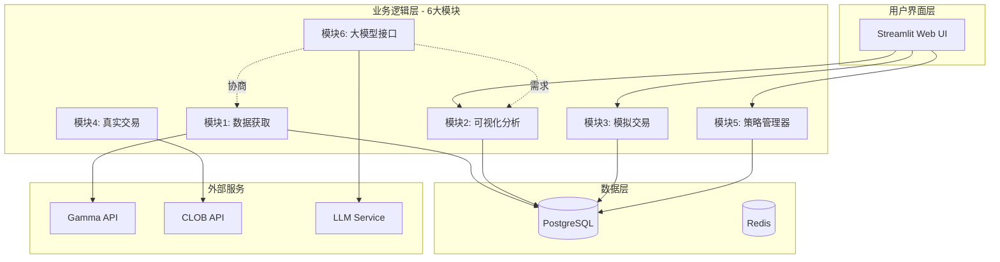

# PolyOMB - Polymarket 自动化交易与数据分析平台

> 面向预测市场的智能化数据分析与自动化交易解决方案

---

## 项目背景

预测市场（Prediction Market）是一个让人们用真金白银对未来事件进行预测的平台。Polymarket 是目前全球最大的预测市场之一，涵盖政治、体育、加密货币等各类事件。

然而，对于希望深入分析和自动化交易的用户来说，面临以下挑战：
- **数据获取困难**：Polymarket API 不够规整，字段经常变化
- **分析工具缺乏**：现有工具多为代码导向，非技术用户难以使用
- **策略实现复杂**：交易策略需要编程实现，门槛较高
- **缺乏模拟环境**：无法在无风险环境下测试策略

**PolyOMB 旨在解决这些问题**，提供一个模块化、可视化、智能化的预测市场分析与交易平台。

---

## 核心目标

1. **数据整合**：建立完整的数据获取和持久化系统，解决 API 不规整问题
2. **可视化分析**：提供直观的图表和分析工具，支持自定义可视化需求
3. **策略管理**：采用 OpenClaw 式 Skill 系统，让策略像插件一样易于管理和分享
4. **模拟交易**：提供完整的虚拟交易环境，支持策略回测和验证
5. **智能协调**：集成大模型接口，实现自然语言驱动的数据分析和策略调整

---

## 技术栈

- **编程语言**: Python 3.11+
- **后端框架**: FastAPI（异步支持）
- **数据库**: PostgreSQL 15+（主存储）+ Redis（缓存）
- **前端/可视化**: Streamlit / Plotly
- **任务队列**: Celery + Redis
- **LLM 接口**: LiteLLM（多模型支持）
- **数据格式**: Parquet（分析导出）

---

## 功能模块概览

| 序号 | 模块名称 | 优先级 | 状态 | 说明 |
|------|---------|--------|------|------|
| 1 | 数据获取模块 | P0 | 设计中 | Gamma API 数据抓取、数据清洗、增量更新 |
| 2 | 可视化分析模块 | P0 | 设计中 | 图表展示、自定义分析、热图生成 |
| 3 | 模拟交易模块 | P1 | 规划中 | 虚拟账户、策略回测、P&L 跟踪 |
| 4 | 真实交易模块 | P2 | 规划中 | 与 Polymarket 真实交互（第二阶段）|
| 5 | 策略管理器 | P1 | 设计中 | Skill 式策略管理、策略市场、参数配置 |
| 6 | 大模型接口 | P1 | 设计中 | 自然语言分析、自动数据获取协调、可视化生成 |

---

## 系统架构



---

## 核心数据库表

| 表名 | 用途 | 关键字段 |
|------|------|----------|
| `markets` | 市场信息 | question, category, volume, liquidity |
| `events` | 事件信息 | title, tags, volume_24h |
| `price_history` | 价格历史 | timestamp, price_yes, price_no |
| `accounts` | 虚拟账户 | balance, total_pnl |
| `positions` | 持仓记录 | side, size, unrealized_pnl |
| `trades` | 交易记录 | side, price, is_simulated |
| `strategies` | 策略定义 | skill_definition, params |
| `llm_requests` | LLM请求记录 | user_prompt, parsed_intent |

完整数据库设计见：`R0003 项目C-PolyOMB数据库设计方案.md`

---

## 里程碑

- [ ] **M1: 数据基础设施** (4-6周)
  - 数据获取模块开发
  - PostgreSQL 数据库搭建
  - 基础数据可视化
  
- [ ] **M2: 分析与策略** (4-6周)
  - 可视化分析模块
  - 策略管理器基础版
  - 模拟交易系统
  
- [ ] **M3: 智能化** (4-6周)
  - 大模型接口集成
  - 自定义分析功能
  - 策略市场
  
- [ ] **M4: 生产就绪** (待定)
  - 真实交易模块
  - 性能优化
  - 安全加固

---

## 约束与原则

1. **安全优先**
   - 密钥本地存储，不上传服务器
   - 真实交易前必须通过模拟交易验证
   
2. **模块化设计**
   - 各模块可独立运行
   - 模块间通过标准接口通信
   
3. **开源友好**
   - 参考开源项目最佳实践
   - 策略 Skill 可社区分享
   
4. **用户友好**
   - 支持自然语言交互
   - 可视化优先于代码

---

## 关键参考资源

### 代码资产
- `CodeLib/00019/Polymarket Quantitative Trading/` - 现有的 Gamma API 代码
- `CodeLib/00020/` - OpenClaw 源码参考

### 调研报告
- `R0001 项目A-00019代码结构分析报告.md` - 代码资产分析
- `R0002 项目B-OpenClaw Skill系统深度分析.md` - Skill架构参考
- `R0003 项目C-PolyOMB数据库设计方案.md` - 数据库设计
- `R0004 项目D-开源预测市场工具调研报告.md` - 竞品分析

### 设计文档
- `A0010 PolyOMB 项目讨论记录.md` - 完整讨论过程
- `polyomb_design_draft.md` - 设计方案草案

---

## 工作流说明

本项目采用「目标 → 拆解 → 执行」的工作流：

```
PROJECT.md (总体目标)
    ↓
讨论细化 → 更新设计文档
    ↓
代码实现
```

### 当前阶段

正在进行**设计细化阶段**，已完成：
- ✅ 需求分析
- ✅ 技术调研
- ✅ 架构设计
- ✅ 数据库设计
- ⏳ 下一步：生成可执行 Prompt，开始编码

---

## 联系方式

- **GitHub**: https://github.com/vERSAsONIC/kimi-roles (角色系统同步)

---

*项目创建时间：2026-02-15 | 最后更新：2026-02-15*
