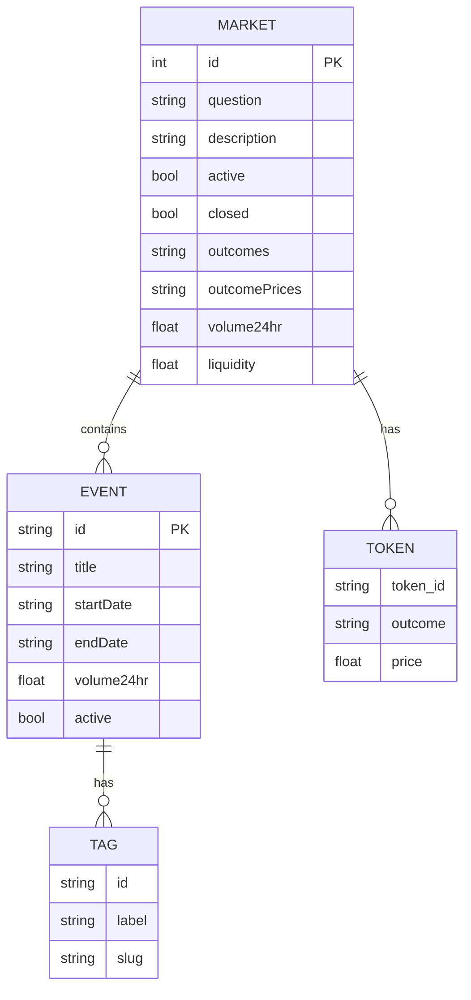

# 项目A：00019代码结构分析报告

> 研究员角色执行 | 日期：2026-02-15

---

## 📁 目录结构概览

```
CodeLib/00019/
├── Polymarket Quantitative Trading/          # 主项目目录
│   ├── agents-main/                          # Python Agent框架
│   │   ├── agents/
│   │   │   ├── polymarket/                   # Polymarket相关
│   │   │   │   ├── gamma.py                  # Gamma API客户端 ⭐核心
│   │   │   │   └── polymarket.py             # Polymarket主类
│   │   │   ├── utils/
│   │   │   │   └── objects.py                # 数据模型定义 ⭐核心
│   │   │   ├── application/                  # 应用层
│   │   │   └── connectors/                   # 连接器
│   │   ├── tests/
│   │   └── docs/
│   ├── debug_gamma_api.py                    # API调试脚本 ⭐核心
│   ├── debug_gamma_api_v2.py                 # API调试v2
│   ├── fetch_high_conviction_events.py       # 高信念事件抓取
│   ├── fetch_politics_90_95.py              # 政治类事件抓取
│   ├── get_active_markets.py                 # 活跃市场获取
│   ├── get_markets_order_status.py           # 订单状态查询
│   ├── gamma api.md                          # API文档 ⭐核心
│   ├── mermaid/                              # 图表文件
│   └── plans/                                # 计划文档
└── ...
```

---

## 🔍 核心组件分析

### 1. GammaMarketClient 类 (`agents/polymarket/gamma.py`)

**定位**：Polymarket Gamma API 的统一访问客户端

**核心功能**：

| 方法 | 功能 | 返回值 |
|------|------|--------|
| `get_markets()` | 通用市场查询 | List[Market] / JSON |
| `get_events()` | 通用事件查询 | List[PolymarketEvent] / JSON |
| `get_all_current_markets()` | 获取所有活跃市场（自动分页） | List[Market] |
| `get_clob_tradable_markets()` | 获取可CLOB交易的市场 | List[Market] |
| `parse_pydantic_market()` | 解析市场数据为Pydantic对象 | Market |

**API端点**：
```python
BASE_URL = "https://gamma-api.polymarket.com"
MARKETS_ENDPOINT = "/markets"
EVENTS_ENDPOINT = "/events"
```

**分页机制**：
```python
offset = 0
while True:
    params = {"limit": 100, "offset": offset, ...}
    batch = get_markets(params)
    if len(batch) < 100: break
    offset += 100
```

---

### 2. 数据模型定义 (`agents/utils/objects.py`)

**使用 Pydantic 进行数据验证和序列化**

#### 核心模型：

**Market 类**（主要字段）：
```python
class Market(BaseModel):
    id: int
    question: str                    # 市场问题
    description: str                 # 描述
    active: bool                     # 是否活跃
    closed: bool                     # 是否关闭
    funded: bool
    outcomes: str                    # 结果选项（JSON字符串）
    outcome_prices: str             # 结果价格（JSON字符串）
    clob_token_ids: Optional[str]   # CLOB代币ID
    spread: float
    volume: Optional[float]         # 交易量
    volume24hr: Optional[float]     # 24小时交易量
    liquidity: Optional[float]      # 流动性
    events: Optional[list[PolymarketEvent]]  # 关联事件
    clobRewards: list[ClobReward]   # CLOB奖励
```

**PolymarketEvent 类**（主要字段）：
```python
class PolymarketEvent(BaseModel):
    id: str
    ticker: Optional[str]
    title: Optional[str]            # 事件标题
    startDate: Optional[str]        # 开始日期
    endDate: Optional[str]          # 结束日期
    active: Optional[bool]
    closed: Optional[bool]
    volume: Optional[float]
    volume24hr: Optional[float]
    liquidity: Optional[float]
    tags: Optional[list[Tag]]       # 标签（Politics等）
    markets: Optional[list[Market]] # 关联市场
```

**其他模型**：
- `ClobReward`: CLOB奖励信息
- `Tag`: 标签（id, label, slug）
- `Trade`: 交易记录

---

### 3. API数据结构调试脚本 (`debug_gamma_api.py`)

**功能**：分析 Gamma API 返回的真实数据结构

**关键发现**：

| 字段 | 位置 | 数据类型 | 说明 |
|------|------|----------|------|
| `tags` | Market/Event | list[dict/str] | 分类标签 |
| `category` | Market | string | 类别 |
| `tokens` | Market | list[dict] | 代币信息（含price/outcome）|
| `outcomePrices` | Market | string(JSON) | 结果价格数组 |
| `events` | Market | list[dict] | 关联事件（含tags）|
| `volume24hr` | Market/Event | float | 24小时交易量 |
| `liquidity` | Market/Event | float | 流动性 |

**关键参数**：
```python
params = {
    "limit": 20,
    "active": "true",
    "closed": "false",
    "sort": "volume24hr",
    "ascending": "false",
    "populateEvents": "true"  # 获取关联Event信息
}
```

---

### 4. 业务逻辑脚本分析

#### `fetch_high_conviction_events.py`
- 抓取高信念度事件
- 筛选条件：价格接近0或1（确定性高）

#### `fetch_politics_90_95.py`
- 抓取政治类事件
- 筛选条件：价格在0.9-0.95之间

#### `get_active_markets.py`
- 获取当前活跃市场
- 基础数据获取示例

---

## 📊 数据结构图谱



---

## ✅ 可复用组件清单

### 直接可用
| 组件 | 文件 | 用途 |
|------|------|------|
| GammaMarketClient | gamma.py | API客户端核心 |
| Market模型 | objects.py | 市场数据验证 |
| PolymarketEvent模型 | objects.py | 事件数据验证 |
| 分页逻辑 | gamma.py:136 | 大数据量获取 |
| 调试脚本 | debug_gamma_api.py | API测试模板 |

### 需适配改造
| 组件 | 改造点 |
|------|--------|
| Pydantic模型 | 添加SQLAlchemy兼容 |
| 本地文件存储 | 改为数据库存储 |
| 同步HTTP | 改为异步（httpx/async）|

---

## ⚠️ 已知问题

1. **API字段不稳定性**
   - 部分字段可能缺失（creationDate等）
   - 使用 `Optional[]` 处理

2. **JSON字符串字段**
   - `outcomes`, `outcomePrices`, `clobTokenIds` 为JSON字符串
   - 需要 `json.loads()` 解析

3. **Tag格式不一致**
   - 有时是字符串列表，有时是字典列表

---

## 🎯 PolyOMB应用建议

### 模块1（数据获取）复用方案：

```python
# 复用 GammaMarketClient，改造点：
1. 添加数据库写入方法
2. 添加增量更新逻辑
3. 添加字段变更检测
4. 添加异步支持
```

### 数据库设计参考：

基于现有Pydantic模型，可直接转换为SQLAlchemy模型：
- `Market` → `markets` 表
- `PolymarketEvent` → `events` 表
- `Tag` → `tags` 表 + 关联表

---

## 📁 相关文件位置

| 文件 | 路径 |
|------|------|
| Gamma API客户端 | `CodeLib/00019/Polymarket Quantitative Trading/agents-main/agents/polymarket/gamma.py` |
| 数据模型 | `CodeLib/00019/Polymarket Quantitative Trading/agents-main/agents/utils/objects.py` |
| API文档 | `CodeLib/00019/Polymarket Quantitative Trading/gamma api.md` |
| 调试脚本 | `CodeLib/00019/Polymarket Quantitative Trading/debug_gamma_api.py` |

---

*报告生成时间：2026-02-15 | 研究员角色*
