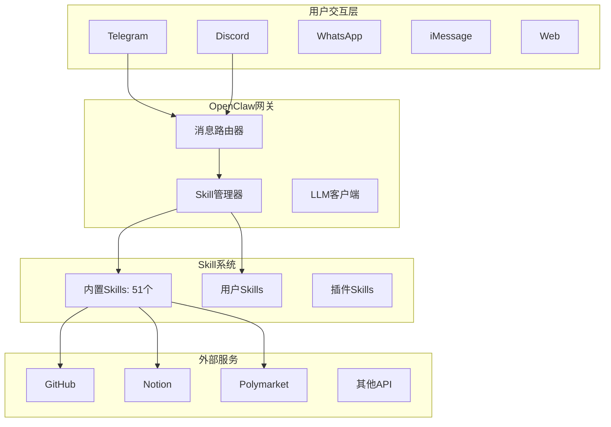
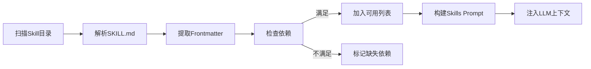
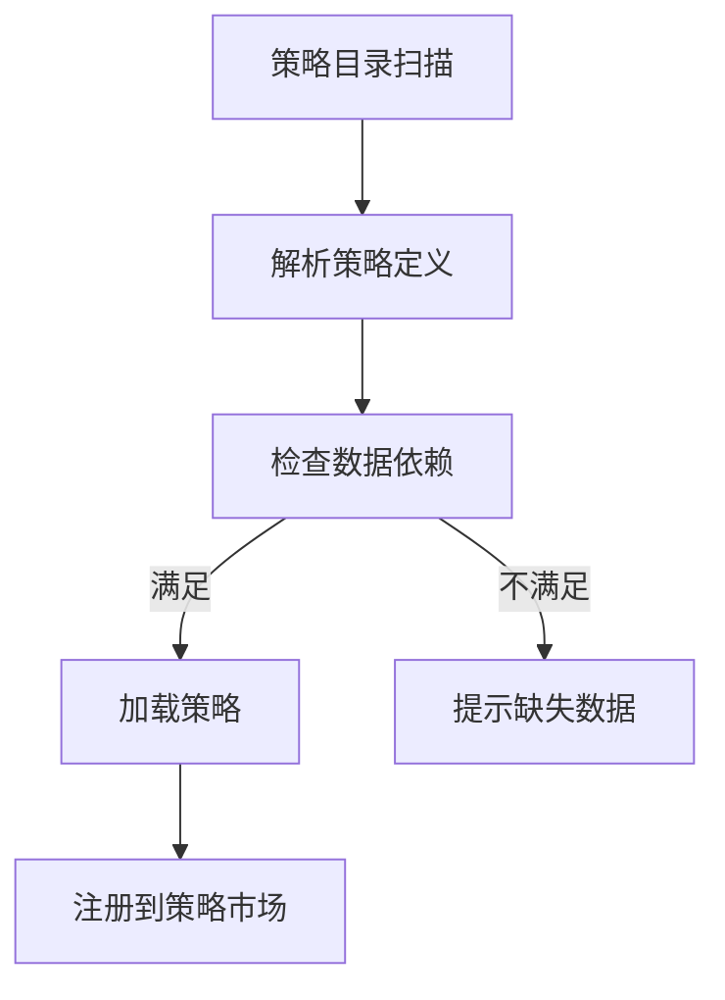

# 项目B：OpenClaw Skill系统深度分析报告

> 研究员角色执行 | 日期：2026-02-15

---

## 📊 系统概览

**OpenClaw** = 本地运行的AI网关 + 模块化Skill系统



---

## 🔧 Skill系统核心架构

### 1. Skill定义格式（SKILL.md）

每个Skill由一个 `SKILL.md` 文件定义，采用 **YAML Frontmatter + Markdown** 格式：

```yaml
---
name: github                           # Skill标识符
description: "使用gh CLI与GitHub交互"   # LLM看到的描述
homepage: https://...                  # 可选：项目主页
metadata:
  {
    "openclaw":
      {
        "emoji": "🐙",                # 显示图标
        "requires": { "bins": ["gh"] },  # 依赖检查
        "install":                       # 自动安装配置
          [
            {
              "id": "brew",
              "kind": "brew",
              "formula": "gh",
              "bins": ["gh"],
            },
          ],
      },
  }
---

# Skill使用说明（Markdown）

## Pull Requests
检查CI状态：
```bash
gh pr checks 55 --repo owner/repo
```
...
```

### Frontmatter字段详解

| 字段 | 类型 | 说明 |
|------|------|------|
| `name` | string | Skill唯一标识 |
| `description` | string | LLM选择Skill时的依据 |
| `homepage` | string | 项目主页URL |
| `metadata.openclaw` | object | OpenClaw专用配置 |
| `metadata.openclaw.emoji` | string | 显示图标 |
| `metadata.openclaw.requires.bins` | string[] | 需要的可执行文件 |
| `metadata.openclaw.requires.env` | string[] | 需要的环境变量 |
| `metadata.openclaw.install` | object[] | 自动安装配置 |

### InstallSpec配置

```typescript
type SkillInstallSpec = {
  id?: string;              // 安装器ID
  kind: "brew" | "node" | "go" | "uv" | "download";
  label?: string;           // 显示标签
  bins?: string[];          // 安装的可执行文件
  os?: string[];            // 适用系统
  formula?: string;         // brew包名
  package?: string;         // npm/apt包名
  module?: string;          // go模块
  url?: string;             // 下载URL
  archive?: string;         // 压缩包类型
  extract?: boolean;        // 是否解压
  stripComponents?: number; // 解压时去掉的目录层数
  targetDir?: string;       // 目标目录
}
```

---

## 🏗️ Skill加载机制

### 加载优先级（从高到低）

```
1. workspace skills (项目级)
   → ./skills/
   
2. agents-skills-project (项目级agents)
   → ./.agents/skills/
   
3. agents-skills-personal (个人级agents)
   → ~/.agents/skills/
   
4. openclaw-managed (OpenClaw管理)
   → ~/.config/openclaw/skills/
   
5. openclaw-bundled (内置)
   → /usr/lib/openclaw/skills/
   
6. openclaw-extra (额外目录)
   → 配置文件指定
```

**优先级规则**：后加载的覆盖先加载的（同名Skill）

### 加载流程



### 核心代码（workspace.ts）

```typescript
// 多源加载
const sources = [
  { dir: bundledSkillsDir, source: "openclaw-bundled" },
  { dir: managedSkillsDir, source: "openclaw-managed" },
  { dir: personalAgentsSkillsDir, source: "agents-skills-personal" },
  { dir: workspaceSkillsDir, source: "openclaw-workspace" },
  ...extraDirs,
];

// 合并（后覆盖前）
const merged = new Map<string, Skill>();
for (const skill of allSkills) {
  merged.set(skill.name, skill);  // 同名覆盖
}
```

---

## 🎯 Skill运行流程

### 1. LLM选择Skill

```
用户：查看我的GitHub PR
    ↓
LLM分析：需要github skill
    ↓
LLM生成命令：gh pr list --repo owner/repo
    ↓
OpenClaw执行命令
    ↓
返回结果给用户
```

### 2. Skill命令映射

```typescript
type SkillCommandSpec = {
  name: string;           // 命令名（如 github_pr）
  skillName: string;      // 所属Skill
  description: string;    // 命令描述
  dispatch?: {            // 可选：确定性分发
    kind: "tool";
    toolName: string;     // 对应工具名
    argMode?: "raw";      // 参数传递方式
  };
}
```

### 3. 依赖检查机制

```typescript
type SkillEligibilityContext = {
  remote?: {
    platforms: string[];
    hasBin: (bin: string) => boolean;      // 检查可执行文件
    hasAnyBin: (bins: string[]) => boolean;
  };
};

function shouldIncludeSkill({
  entry,
  config,
  eligibility,
}: {
  entry: SkillEntry;
  config?: OpenClawConfig;
  eligibility?: SkillEligibilityContext;
}): boolean {
  // 检查 bins 依赖
  if (requires.bins) {
    for (const bin of requires.bins) {
      if (!eligibility?.remote?.hasBin(bin)) return false;
    }
  }
  // 检查 env 依赖
  if (requires.env) {
    for (const env of requires.env) {
      if (!process.env[env]) return false;
    }
  }
  return true;
}
```

---

## 📦 内置Skills分析（51个）

### 分类统计

| 类别 | Skills | 示例 |
|------|--------|------|
| 开发工具 | github, coding-agent | 代码管理、开发辅助 |
| 生产力 | notion, obsidian, bear-notes | 笔记、文档 |
| 通讯 | discord, telegram, imsg | 消息发送 |
| 媒体 | canvas, openai-image-gen | 图像生成 |
| 区块链 | (Polymarket通过插件) | 交易、DeFi |
| 系统 | healthcheck, mcporter | 系统监控 |

### 典型Skill示例对比

#### GitHub Skill（依赖bin）
```yaml
metadata:
  openclaw:
    requires: { bins: ["gh"] }
    install:
      - kind: "brew"
        formula: "gh"
        bins: ["gh"]
```

#### Notion Skill（依赖env）
```yaml
metadata:
  openclaw:
    requires: { env: ["NOTION_API_KEY"] }
    primaryEnv: "NOTION_API_KEY"  # 主要环境变量
```

---

## 🔌 插件系统（Extensions）

OpenClaw支持通过插件添加新Skill：

```
extensions/
├── msteams/          # Microsoft Teams
├── matrix/           # Matrix协议
├── zalo/             # Zalo
├── voice-call/       # 语音通话
└── ...
```

每个插件可以：
- 添加新Channel（消息平台）
- 添加新Skill
- 扩展OpenClaw功能

---

## 🧠 PolyOMB可借鉴的设计

### 1. Skill即策略

将交易策略封装为Skill：

```yaml
---
name: momentum-strategy
description: "基于价格动量的交易策略"
metadata:
  polyomb:
    emoji: "📈"
    requires:
      data: ["price_history", "volume"]
      apis: ["gamma"]
    params:
      - name: "lookback_period"
        type: "int"
        default: 14
---

## 策略逻辑
1. 计算N天价格变化率
2. 变化率>threshold买入YES
3. 变化率<-threshold买入NO
```

### 2. 策略管理器设计

参考OpenClaw的Skill加载机制：



### 3. 依赖检查系统

| 依赖类型 | OpenClaw | PolyOMB |
|----------|----------|---------|
| 可执行文件 | `requires.bins` | - |
| 环境变量 | `requires.env` | `requires.config` |
| 数据源 | - | `requires.data` |
| API密钥 | env | `requires.apis` |

### 4. 策略市场结构

```
strategies/
├── momentum/
│   ├── SKILL.md          # 策略定义
│   └── strategy.py       # 策略实现
├── mean-reversion/
│   ├── SKILL.md
│   └── strategy.py
└── arbitrage/
    ├── SKILL.md
    └── strategy.py
```

---

## 📋 OpenClaw vs PolyOMB 对比

| 特性 | OpenClaw | PolyOMB |
|------|----------|---------|
| **定位** | 通用AI助手 | 预测市场交易平台 |
| **Skill类型** | 工具型 | 策略型 |
| **执行方式** | 命令执行 | 模拟/真实交易 |
| **数据存储** | 本地JSON | PostgreSQL |
| **可视化** | 文本回复 | 图表分析 |
| **LLM角色** | 选择并执行Skill | 协调多模块 |

---

## 🎯 关键洞察

1. **Skill是接口定义**：SKILL.md定义了能力边界，具体实现可以是任意代码

2. **依赖声明式管理**：通过metadata声明依赖，系统自动检查

3. **多源加载+优先级**：允许用户覆盖内置Skill，支持个性化定制

4. **LLM作为调度器**：OpenClaw本身不决策，LLM根据用户请求选择Skill

5. **社区生态**：通过ClawHub分享Skill，形成生态系统

---

## 📁 相关文件位置

| 文件 | 路径 |
|------|------|
| Skill加载核心 | `CodeLib/00020/src/agents/skills/workspace.ts` |
| Frontmatter解析 | `CodeLib/00020/src/agents/skills/frontmatter.ts` |
| 类型定义 | `CodeLib/00020/src/agents/skills/types.ts` |
| GitHub Skill | `CodeLib/00020/skills/github/SKILL.md` |
| Notion Skill | `CodeLib/00020/skills/notion/SKILL.md` |
| 内置Skills目录 | `CodeLib/00020/skills/` (51个) |

---

*报告生成时间：2026-02-15 | 研究员角色*
