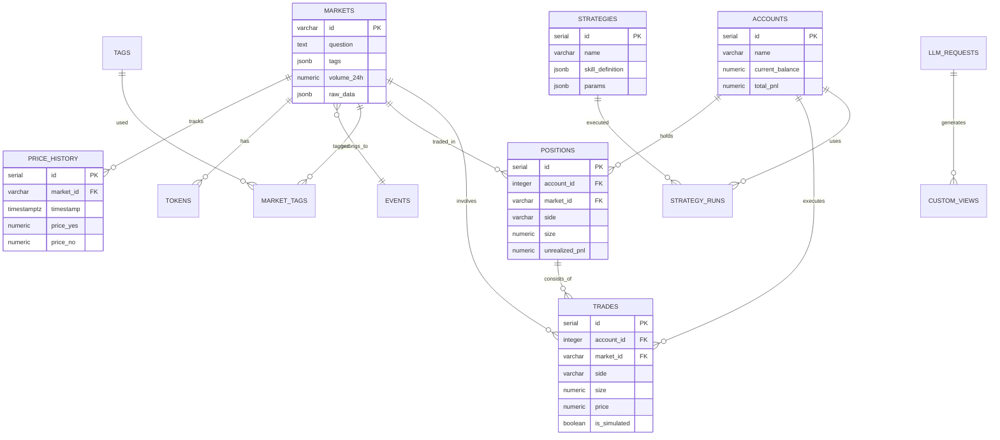

# 项目C：PolyOMB数据库设计方案

> 研究员角色执行 | 日期：2026-02-15
> 基于CodeLib/00019代码分析和Gamma API数据结构

---

## 📊 设计目标

1. **支持Gamma API数据结构**：完整存储Market/Event/Tag数据
2. **历史数据追踪**：价格、交易量的时间序列
3. **模拟交易支持**：虚拟账户、仓位、P&L计算
4. **策略配置存储**：Skill式策略定义和参数
5. **可扩展性**：支持大模型接口的灵活数据需求

---

## 🗄️ 数据库选型

**PostgreSQL 15+**

理由：
- ✅ JSONB支持：存储API原始数据和不规整字段
- ✅ 时间序列：价格历史、交易记录
- ✅ 复杂查询：多表关联、聚合分析
- ✅ 成熟稳定：金融场景验证

---

## 📐 核心表结构设计

### 1. markets（市场表）

```sql
CREATE TABLE markets (
    id VARCHAR(64) PRIMARY KEY,           -- 市场唯一ID
    question TEXT NOT NULL,               -- 问题描述
    description TEXT,                     -- 详细描述
    
    -- 状态
    active BOOLEAN DEFAULT true,
    closed BOOLEAN DEFAULT false,
    archived BOOLEAN DEFAULT false,
    status VARCHAR(32),                   -- 聚合状态
    
    -- 分类
    category VARCHAR(64),                 -- 主要分类
    tags JSONB,                           -- 标签数组 [{"id": "1", "label": "Politics"}]
    
    -- 时间
    start_date TIMESTAMP WITH TIME ZONE,
    end_date TIMESTAMP WITH TIME ZONE,
    resolution_date TIMESTAMP WITH TIME ZONE,
    created_at TIMESTAMP WITH TIME ZONE DEFAULT NOW(),
    updated_at TIMESTAMP WITH TIME ZONE DEFAULT NOW(),
    
    -- 交易相关
    condition_id VARCHAR(64),             -- CTF条件ID
    slug VARCHAR(256),                    -- URL slug
    market_slug VARCHAR(256),             -- 市场slug
    
    -- 流动性和交易量
    volume NUMERIC(24, 8),                -- 总交易量
    volume_24h NUMERIC(24, 8),            -- 24小时交易量
    liquidity NUMERIC(24, 8),             -- 流动性
    spread NUMERIC(10, 4),                -- 价差
    
    -- 结果和代币
    outcomes JSONB,                       -- ["Yes", "No"]
    outcome_prices JSONB,                 -- ["0.65", "0.35"]
    clob_token_ids JSONB,                 -- ["0x...", "0x..."]
    
    -- 奖励
    clob_rewards JSONB,                   -- CLOB奖励详情
    rewards_min_size NUMERIC(24, 8),
    rewards_max_spread NUMERIC(10, 4),
    
    -- 关联事件
    event_id VARCHAR(64) REFERENCES events(id),
    
    -- 原始数据备份
    raw_data JSONB,                       -- API完整原始响应
    
    -- 元数据
    enable_order_book BOOLEAN DEFAULT false,
    cometitive NUMERIC(10, 4),
    comment_count INTEGER DEFAULT 0,
    
    -- 索引
    CONSTRAINT valid_dates CHECK (end_date > start_date OR end_date IS NULL)
);

-- 索引
CREATE INDEX idx_markets_active ON markets(active);
CREATE INDEX idx_markets_category ON markets(category);
CREATE INDEX idx_markets_tags ON markets USING GIN(tags);
CREATE INDEX idx_markets_end_date ON markets(end_date);
CREATE INDEX idx_markets_volume_24h ON markets(volume_24h DESC);
CREATE INDEX idx_markets_created_at ON markets(created_at DESC);
```

### 2. events（事件表）

```sql
CREATE TABLE events (
    id VARCHAR(64) PRIMARY KEY,
    ticker VARCHAR(128),
    slug VARCHAR(256),
    title TEXT,
    
    -- 描述
    description TEXT,
    image_url TEXT,
    icon_url TEXT,
    
    -- 状态
    active BOOLEAN DEFAULT true,
    closed BOOLEAN DEFAULT false,
    archived BOOLEAN DEFAULT false,
    featured BOOLEAN DEFAULT false,
    restricted BOOLEAN DEFAULT false,
    
    -- 时间
    start_date TIMESTAMP WITH TIME ZONE,
    end_date TIMESTAMP WITH TIME ZONE,
    created_at TIMESTAMP WITH TIME ZONE DEFAULT NOW(),
    updated_at TIMESTAMP WITH TIME ZONE DEFAULT NOW(),
    
    -- 交易量
    volume NUMERIC(24, 8),
    volume_24h NUMERIC(24, 8),
    liquidity NUMERIC(24, 8),
    liquidity_clob NUMERIC(24, 8),
    
    -- 分类
    tags JSONB,                           -- 标签数组
    
    -- 其他
    review_status VARCHAR(32),
    comment_count INTEGER DEFAULT 0,
    enable_order_book BOOLEAN DEFAULT false,
    cyom BOOLEAN DEFAULT false,          -- Create Your Own Market
    show_all_outcomes BOOLEAN DEFAULT false,
    
    -- 原始数据
    raw_data JSONB
);

-- 索引
CREATE INDEX idx_events_active ON events(active);
CREATE INDEX idx_events_tags ON events USING GIN(tags);
CREATE INDEX idx_events_volume_24h ON events(volume_24h DESC);
```

### 3. price_history（价格历史表）

```sql
CREATE TABLE price_history (
    id SERIAL PRIMARY KEY,
    market_id VARCHAR(64) REFERENCES markets(id) ON DELETE CASCADE,
    
    -- 时间戳（精确到分钟）
    timestamp TIMESTAMP WITH TIME ZONE NOT NULL,
    
    -- YES价格
    price_yes NUMERIC(10, 4) NOT NULL,
    price_no NUMERIC(10, 4) NOT NULL,
    
    -- 隐含概率
    probability_yes NUMERIC(10, 4),
    probability_no NUMERIC(10, 4),
    
    -- 交易量
    volume_24h NUMERIC(24, 8),
    volume_increment NUMERIC(24, 8),     -- 自上次记录增量
    
    -- 流动性
    liquidity NUMERIC(24, 8),
    spread NUMERIC(10, 4),
    
    -- 数据质量
    data_source VARCHAR(32) DEFAULT 'gamma_api',
    is_interpolated BOOLEAN DEFAULT false,  -- 是否为插值数据
    
    -- 原始数据
    raw_data JSONB
);

-- 索引（时间序列优化）
CREATE INDEX idx_price_history_market_time ON price_history(market_id, timestamp DESC);
CREATE INDEX idx_price_history_timestamp ON price_history(timestamp DESC);

-- 分区（按时间）
-- 建议按月份分区，便于历史数据归档
```

### 4. tokens（代币表）

```sql
CREATE TABLE tokens (
    id VARCHAR(128) PRIMARY KEY,          -- CLOB Token ID
    market_id VARCHAR(64) REFERENCES markets(id) ON DELETE CASCADE,
    
    -- 结果
    outcome VARCHAR(32) NOT NULL,         -- "Yes" 或 "No"
    outcome_index INTEGER,                -- 0 或 1
    
    -- 当前价格
    current_price NUMERIC(10, 4),
    
    -- CTF相关
    condition_id VARCHAR(64),
    asset_address VARCHAR(128),           -- 合约地址
    
    created_at TIMESTAMP WITH TIME ZONE DEFAULT NOW(),
    updated_at TIMESTAMP WITH TIME ZONE DEFAULT NOW()
);

CREATE INDEX idx_tokens_market ON tokens(market_id);
```

### 5. tags（标签表）

```sql
CREATE TABLE tags (
    id VARCHAR(64) PRIMARY KEY,
    label VARCHAR(128) NOT NULL UNIQUE,   -- 显示名称 "Politics"
    slug VARCHAR(128) UNIQUE,             -- URL友好 "politics"
    
    -- 控制
    force_show BOOLEAN DEFAULT false,
    
    -- 时间
    created_at TIMESTAMP WITH TIME ZONE DEFAULT NOW(),
    updated_at TIMESTAMP WITH TIME ZONE DEFAULT NOW()
);

-- 关联表：market_tags
CREATE TABLE market_tags (
    market_id VARCHAR(64) REFERENCES markets(id) ON DELETE CASCADE,
    tag_id VARCHAR(64) REFERENCES tags(id) ON DELETE CASCADE,
    PRIMARY KEY (market_id, tag_id)
);

-- 关联表：event_tags
CREATE TABLE event_tags (
    event_id VARCHAR(64) REFERENCES events(id) ON DELETE CASCADE,
    tag_id VARCHAR(64) REFERENCES tags(id) ON DELETE CASCADE,
    PRIMARY KEY (event_id, tag_id)
);
```

---

## 💰 模拟交易相关表

### 6. accounts（虚拟账户表）

```sql
CREATE TABLE accounts (
    id SERIAL PRIMARY KEY,
    name VARCHAR(128) NOT NULL,
    
    -- 虚拟资金
    initial_balance NUMERIC(24, 8) NOT NULL DEFAULT 10000.00,
    current_balance NUMERIC(24, 8) NOT NULL DEFAULT 10000.00,
    
    -- 统计
    total_trades INTEGER DEFAULT 0,
    winning_trades INTEGER DEFAULT 0,
    losing_trades INTEGER DEFAULT 0,
    
    -- 盈亏
    total_pnl NUMERIC(24, 8) DEFAULT 0,
    total_pnl_percentage NUMERIC(10, 4) DEFAULT 0,
    
    -- 状态
    is_active BOOLEAN DEFAULT true,
    created_at TIMESTAMP WITH TIME ZONE DEFAULT NOW(),
    updated_at TIMESTAMP WITH TIME ZONE DEFAULT NOW()
);
```

### 7. positions（仓位表）

```sql
CREATE TABLE positions (
    id SERIAL PRIMARY KEY,
    account_id INTEGER REFERENCES accounts(id) ON DELETE CASCADE,
    market_id VARCHAR(64) REFERENCES markets(id),
    
    -- 仓位方向
    side VARCHAR(8) NOT NULL,             -- "YES" 或 "NO"
    
    -- 数量
    size NUMERIC(24, 8) NOT NULL,         -- 代币数量
    avg_entry_price NUMERIC(10, 4),       -- 平均入场价格
    
    -- 成本
    total_cost NUMERIC(24, 8),            -- 总成本
    fees_paid NUMERIC(24, 8) DEFAULT 0,   -- 手续费
    
    -- 当前状态
    current_price NUMERIC(10, 4),         -- 当前市场价格
    unrealized_pnl NUMERIC(24, 8),        -- 未实现盈亏
    unrealized_pnl_percentage NUMERIC(10, 4),
    
    -- 时间
    opened_at TIMESTAMP WITH TIME ZONE DEFAULT NOW(),
    closed_at TIMESTAMP WITH TIME ZONE,
    
    -- 状态
    status VARCHAR(16) DEFAULT 'open',    -- open/closed
    
    -- 原始交易IDs
    trade_ids INTEGER[]                   -- 关联的trades
);

CREATE INDEX idx_positions_account ON positions(account_id);
CREATE INDEX idx_positions_market ON positions(market_id);
CREATE INDEX idx_positions_status ON positions(status);
```

### 8. trades（交易记录表）

```sql
CREATE TABLE trades (
    id SERIAL PRIMARY KEY,
    account_id INTEGER REFERENCES accounts(id) ON DELETE CASCADE,
    position_id INTEGER REFERENCES positions(id) ON DELETE SET NULL,
    market_id VARCHAR(64) REFERENCES markets(id),
    
    -- 交易详情
    side VARCHAR(8) NOT NULL,             -- BUY/SELL
    outcome VARCHAR(8) NOT NULL,          -- YES/NO
    size NUMERIC(24, 8) NOT NULL,         -- 数量
    price NUMERIC(10, 4) NOT NULL,        -- 成交价格
    
    -- 金额
    amount NUMERIC(24, 8),                -- 总金额
    fee NUMERIC(24, 8) DEFAULT 0,         -- 手续费
    total_cost NUMERIC(24, 8),            -- 总成本
    
    -- 模拟/真实
    is_simulated BOOLEAN DEFAULT true,
    
    -- 策略关联
    strategy_id INTEGER REFERENCES strategies(id),
    
    -- 时间
    executed_at TIMESTAMP WITH TIME ZONE DEFAULT NOW(),
    
    -- 原始数据
    raw_data JSONB
);

CREATE INDEX idx_trades_account ON trades(account_id);
CREATE INDEX idx_trades_market ON trades(market_id);
CREATE INDEX idx_trades_executed_at ON trades(executed_at DESC);
```

---

## 🧠 策略系统相关表

### 9. strategies（策略表）

```sql
CREATE TABLE strategies (
    id SERIAL PRIMARY KEY,
    name VARCHAR(128) NOT NULL UNIQUE,    -- 策略标识符
    display_name VARCHAR(256),            -- 显示名称
    
    -- 描述
    description TEXT,
    emoji VARCHAR(16) DEFAULT '📈',
    
    -- Skill定义
    skill_definition JSONB,               -- SKILL.md内容
    
    -- 依赖声明
    required_data JSONB,                  -- ["price_history", "volume"]
    required_apis JSONB,                  -- ["gamma"]
    
    -- 参数配置
    params JSONB,                         -- 参数定义和默认值
    
    -- 实现
    implementation_type VARCHAR(32) DEFAULT 'python',  -- python/javascript
    implementation_code TEXT,             -- 策略代码
    
    -- 风险设置
    max_position_size NUMERIC(10, 4) DEFAULT 0.1,      -- 最大仓位10%
    stop_loss_percentage NUMERIC(10, 4) DEFAULT 0.2,   -- 止损20%
    
    -- 统计
    total_runs INTEGER DEFAULT 0,
    successful_runs INTEGER DEFAULT 0,
    
    -- 元数据
    is_active BOOLEAN DEFAULT true,
    is_builtin BOOLEAN DEFAULT false,     -- 是否为内置策略
    created_at TIMESTAMP WITH TIME ZONE DEFAULT NOW(),
    updated_at TIMESTAMP WITH TIME ZONE DEFAULT NOW()
);
```

### 10. strategy_runs（策略运行记录表）

```sql
CREATE TABLE strategy_runs (
    id SERIAL PRIMARY KEY,
    strategy_id INTEGER REFERENCES strategies(id),
    account_id INTEGER REFERENCES accounts(id),
    
    -- 运行参数
    params JSONB,                         -- 实际使用的参数
    
    -- 运行范围
    start_time TIMESTAMP WITH TIME ZONE,
    end_time TIMESTAMP WITH TIME ZONE,
    
    -- 结果
    total_trades INTEGER DEFAULT 0,
    pnl NUMERIC(24, 8) DEFAULT 0,
    pnl_percentage NUMERIC(10, 4),
    
    -- 状态
    status VARCHAR(16) DEFAULT 'running', -- running/completed/failed
    error_message TEXT,
    
    created_at TIMESTAMP WITH TIME ZONE DEFAULT NOW()
);
```

---

## 🔍 大模型接口相关表

### 11. llm_requests（LLM请求记录表）

```sql
CREATE TABLE llm_requests (
    id SERIAL PRIMARY KEY,
    request_type VARCHAR(64) NOT NULL,    -- 'data_analysis', 'visualization', etc.
    
    -- 用户输入
    user_prompt TEXT NOT NULL,
    
    -- LLM处理结果
    parsed_intent JSONB,                  -- 解析后的意图
    required_data_fields JSONB,           -- 需要的字段
    generated_query JSONB,                -- 生成的查询
    
    -- 执行状态
    status VARCHAR(16) DEFAULT 'pending', -- pending/processing/completed/failed
    
    -- 关联
    result_id INTEGER,                    -- 关联到具体结果
    
    -- 性能
    processing_time_ms INTEGER,
    token_usage INTEGER,
    
    created_at TIMESTAMP WITH TIME ZONE DEFAULT NOW()
);
```

### 12. custom_views（自定义视图表）

```sql
CREATE TABLE custom_views (
    id SERIAL PRIMARY KEY,
    name VARCHAR(256) NOT NULL,
    description TEXT,
    
    -- 视图定义（由LLM生成）
    view_definition JSONB,                -- 查询条件、图表配置等
    generated_code TEXT,                  -- Python/Matplotlib代码
    
    -- 依赖的数据
    required_markets JSONB,               -- 涉及的市场IDs
    data_range_start TIMESTAMP WITH TIME ZONE,
    data_range_end TIMESTAMP WITH TIME ZONE,
    
    -- 缓存
    last_generated_at TIMESTAMP WITH TIME ZONE,
    cached_result JSONB,                  -- 缓存的结果
    
    created_by_llm_request_id INTEGER REFERENCES llm_requests(id),
    created_at TIMESTAMP WITH TIME ZONE DEFAULT NOW()
);
```

---

## 🔄 数据同步相关表

### 13. sync_jobs（同步任务表）

```sql
CREATE TABLE sync_jobs (
    id SERIAL PRIMARY KEY,
    job_type VARCHAR(32) NOT NULL,        -- 'markets', 'prices', 'events'
    
    -- 范围
    params JSONB,                         -- 同步参数
    
    -- 状态
    status VARCHAR(16) DEFAULT 'pending',
    started_at TIMESTAMP WITH TIME ZONE,
    completed_at TIMESTAMP WITH TIME ZONE,
    
    -- 统计
    records_processed INTEGER DEFAULT 0,
    records_inserted INTEGER DEFAULT 0,
    records_updated INTEGER DEFAULT 0,
    records_failed INTEGER DEFAULT 0,
    
    -- 错误
    error_message TEXT,
    
    created_at TIMESTAMP WITH TIME ZONE DEFAULT NOW()
);

CREATE INDEX idx_sync_jobs_status ON sync_jobs(status);
CREATE INDEX idx_sync_jobs_type ON sync_jobs(job_type);
```

---

## 📊 ER图总览



---

## 📈 性能优化建议

### 1. 分区策略
```sql
-- price_history按时间分区
CREATE TABLE price_history_y2024m01 PARTITION OF price_history
    FOR VALUES FROM ('2024-01-01') TO ('2024-02-01');
```

### 2. 聚合表（用于快速查询）
```sql
-- 市场日统计表
CREATE TABLE market_daily_stats (
    market_id VARCHAR(64),
    date DATE,
    avg_price_yes NUMERIC(10,4),
    max_price_yes NUMERIC(10,4),
    min_price_yes NUMERIC(10,4),
    total_volume NUMERIC(24,8),
    PRIMARY KEY (market_id, date)
);
```

### 3. 索引优化
- 所有外键自动创建索引
- 时间字段排序索引
- JSONB字段GIN索引

---

## 🔧 与现有代码的对应关系

| 现有代码 | 数据库表 | 备注 |
|----------|----------|------|
| `Market` Pydantic模型 | `markets` | 直接映射 |
| `PolymarketEvent` | `events` | 直接映射 |
| `Tag` | `tags` + 关联表 | 多对多关系 |
| `ClobReward` | `markets.clob_rewards` | JSONB存储 |
| 本地JSON仓位 | `positions` | 关系化存储 |
| Gamma API原始数据 | `*.raw_data` | JSONB备份 |

---

## 🎯 PolyOMB模块映射

| 模块 | 主要表 |
|------|--------|
| 模块1: 数据获取 | `markets`, `events`, `tags`, `sync_jobs` |
| 模块2: 可视化分析 | `price_history`, `custom_views`, `llm_requests` |
| 模块3: 模拟交易 | `accounts`, `positions`, `trades` |
| 模块4: 真实交易 | `trades` (is_simulated=false) |
| 模块5: 策略管理器 | `strategies`, `strategy_runs` |
| 模块6: 大模型接口 | `llm_requests`, `custom_views` |

---

## 📝 SQL初始化脚本

```sql
-- 执行顺序：
-- 1. 创建枚举类型（如需要）
-- 2. 创建主表（tags, events, markets）
-- 3. 创建关联表（market_tags, event_tags）
-- 4. 创建历史表（price_history, tokens）
-- 5. 创建交易表（accounts, positions, trades）
-- 6. 创建策略表（strategies, strategy_runs）
-- 7. 创建LLM表（llm_requests, custom_views）
-- 8. 创建工具表（sync_jobs）
-- 9. 创建索引
-- 10. 创建视图和函数
```

完整初始化脚本见：`scripts/init_database.sql`（待生成）

---

*报告生成时间：2026-02-15 | 研究员角色*
