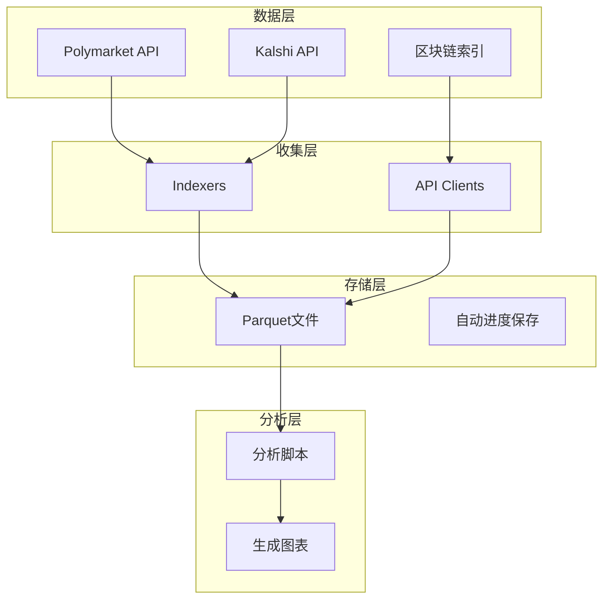
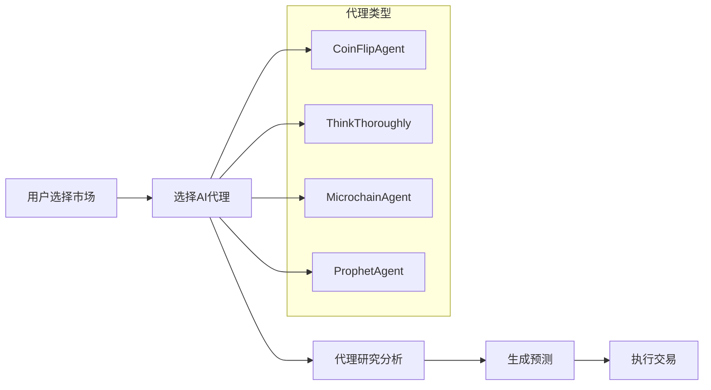
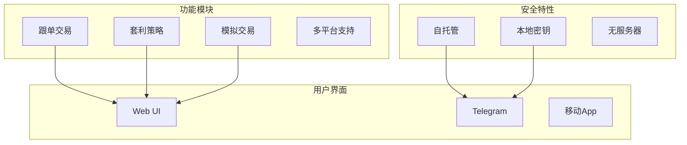
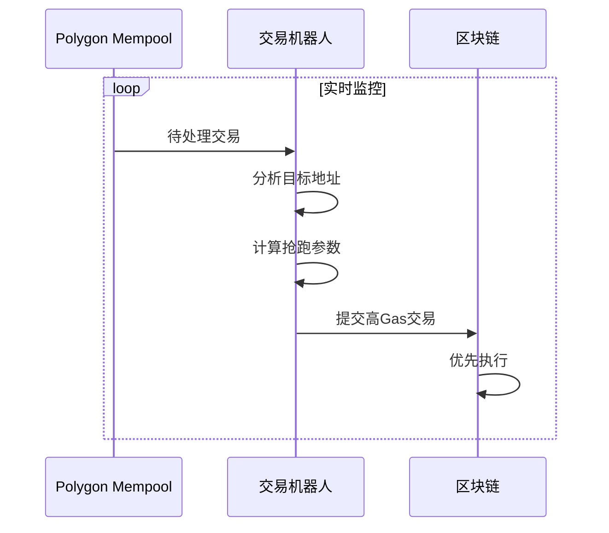

# 项目D：开源预测市场工具调研报告

> 研究员角色执行 | 日期：2026-02-15

---

## 📊 调研概览

本次调研覆盖了 **8+ 个开源预测市场相关项目**，包括：
- 数据分析框架
- 自动化交易机器人
- AI驱动的交易代理
- 去中心化预测市场协议

---

## 🏆 核心发现

### 项目分类矩阵

| 项目 | 类型 | 数据源 | 特色功能 | 活跃度 | PolyOMB可借鉴 |
|------|------|--------|----------|--------|---------------|
| **prediction-market-analysis** | 数据分析 | Polymarket, Kalshi | 36GB数据集，Parquet存储 | ⭐⭐⭐⭐⭐ | ✅ 数据收集架构 |
| **Awesome-Prediction-Market-Tools** | 工具目录 | 综合 | 社区维护的工具清单 | ⭐⭐⭐⭐⭐ | ✅ 生态参考 |
| **prediction-market-agent (Gnosis)** | AI代理 | Omen, Manifold, Polymarket | 多框架AI代理 | ⭐⭐⭐⭐ | ✅ AI代理设计 |
| **OctoBot-Prediction-Market** | 交易机器人 | Polymarket, Kalshi | 模拟交易，跟单 | ⭐⭐⭐⭐ | ✅ 模拟交易系统 |
| **Augur** | 去中心化协议 | 自建市场 | 预言机机制 | ⭐⭐⭐ | ⚠️ 协议设计参考 |
| **Polymarket-Arbitrage-Bot** | 套利机器人 | Polymarket | Mempool监控，抢跑 | ⭐⭐⭐ | ⚠️ 高级交易功能 |
| **PredictOS** | AI框架 | 多平台 | AI代理部署框架 | ⭐⭐⭐ | ✅ 策略框架 |

---

## 📈 重点项目深度分析

### 1. Prediction Market Analysis (Jon-Becker)

**GitHub**: `Jon-Becker/prediction-market-analysis`

#### 核心架构


#### 技术亮点
- **数据集规模**: 36GB压缩数据（Polymarket + Kalshi）
- **存储格式**: Parquet（列式存储，分析友好）
- **断点续传**: 自动进度保存，可中断恢复
- **数据结构**:
  ```
  data/
  ├── kalshi/
  │   ├── markets/
  │   └── trades/
  └── polymarket/
      ├── blocks/
      ├── markets/
      └── trades/
  ```

#### PolyOMB借鉴点
| 功能 | 实现方式 | PolyOMB应用 |
|------|----------|-------------|
| 数据收集 | Indexer架构 | 模块1数据获取 |
| 存储格式 | Parquet | 可选CSV/Parquet导出 |
| 断点续传 | 进度文件 | 同步任务表设计 |

---

### 2. Gnosis Prediction Market Agent

**GitHub**: `gnosis/prediction-market-agent`

#### 核心架构


#### 支持的代理类型
| 代理 | 算法 | 特点 |
|------|------|------|
| coinflip | 随机 | 基准测试 |
| think_thoroughly | 深度思考 | 多步骤推理 |
| microchain | 函数调用 | 可交互式指导 |
| prophet | 预测模型 | GPT-4驱动 |
| knownoutcome | 已知结果 | 测试用 |

#### 技术栈
- **Python 3.11+**
- **Poetry** 依赖管理
- **Streamlit** 交互界面
- **Dune** 链上活动追踪

#### PolyOMB借鉴点
| 功能 | 实现 | PolyOMB应用 |
|------|------|-------------|
| 代理框架 | 可扩展Agent类 | 策略管理器设计 |
| 多市场支持 | Omen/Manifold/Polymarket | 多数据源支持 |
| Streamlit UI | 交互式应用 | 可视化模块参考 |

---

### 3. OctoBot Prediction Market

**GitHub**: `Drakkar-Software/OctoBot-Prediction-Market`

#### 核心特性


#### 功能详解

**1. 跟单交易 (Copy Trading)**
```python
# 概念伪代码
class CopyTradingStrategy:
    def __init__(self, target_profile, budget):
        self.target = target_profile  # Polymarket用户地址
        self.budget = budget
        self.whitelist = []  # 可跟单的市场列表
    
    def on_target_trade(self, trade):
        if trade.market in self.whitelist:
            proportional_size = trade.size * self.budget_ratio
            self.execute_mirror_trade(trade, proportional_size)
```

**2. 套利策略 (Arbitrage)**
- 核心逻辑：买双方成本 < 1 时 guaranteed profit
- 监控市场24/7
- 快速执行套利机会

**3. 模拟交易 (Paper Trading)**
- 虚拟资金测试策略
- 无风险环境验证
- 策略对比和优化

#### 技术栈
- **Python**
- **Docker** 支持
- **Telegram** 集成
- **OctoBot** 框架

#### PolyOMB借鉴点
| 功能 | 实现 | PolyOMB应用 |
|------|------|-------------|
| 模拟交易 | 虚拟账户系统 | 模块3模拟交易 |
| 自托管 | 本地密钥管理 | 真实交易模块安全 |
| 多界面 | Web + Telegram | 可视化模块扩展 |

---

### 4. Polymarket Arbitrage Trading Bot

**GitHub**: `dexorynlabs/polymarket-arbitrage-tradingbot`

#### 核心机制


#### 高级功能
- **Mempool监控**: 实时检测待处理交易
- **抢跑策略**: 高Gas价格优先执行
- **混合适价**: Mempool + API轮询
- **智能风控**: 余额验证，重试机制

#### 配置示例
```env
# 钱包配置
PUBLIC_KEY="0x..."
PRIVATE_KEY="0x..."
RPC_URL="https://polygon-mainnet.infura.io/..."

# 交易参数
TARGET_ADDRESSES="0x...,0x..."
MIN_TRADE_SIZE_USD=100
FRONTRUN_SIZE_MULTIPLIER=0.5
GAS_PRICE_MULTIPLIER=1.2
```

#### ⚠️ 风险提示
> 抢跑交易存在法律和道德风险，可能违反平台规则

---

### 5. Awesome Prediction Market Tools

**GitHub**: `aarora4/Awesome-Prediction-Market-Tools`

#### 工具分类

**AI Agents** (25+ 项目)
- PolyClaw - OpenClaw的Polymarket技能
- PolyOracle - 多LLM共识系统
- PolyRadar - 多AI模型综合分析
- Polyseer - 开源多代理研究平台

**Analytics Tools**
- Oddpool - "预测市场的彭博终端"
- PolyPulse - Chrome扩展AI分析
- PolyMaster - 鲸鱼追踪和预测模型

**Trading Bots**
- 各类自动化交易机器人
- 套利工具
- 跟单系统

#### PolyOMB借鉴点
- **生态参考**: 了解现有工具 landscape
- **功能对标**: 确定差异化定位
- **社区资源**: 潜在合作或集成对象

---

## 🔄 技术栈对比

| 项目 | 语言 | 存储 | UI | 特色 |
|------|------|------|-----|------|
| prediction-market-analysis | Python | Parquet | CLI | 大数据分析 |
| Gnosis Agent | Python | - | Streamlit | AI代理 |
| OctoBot | Python | SQLite | Web/Telegram | 模拟交易 |
| Arbitrage Bot | TypeScript | - | CLI | Mempool监控 |
| PolyOMB (计划) | Python | PostgreSQL | Streamlit | 模块化设计 |

---

## 🎯 PolyOMB差异化定位

### 现有工具缺口

| 需求 | 现有工具 | PolyOMB方案 |
|------|----------|-------------|
| 可视化自定义分析 | ❌ 弱 | ✅ 模块6大模型接口 |
| 策略Skill系统 | ❌ 无 | ✅ 模块5策略管理器 |
| 完整数据持久化 | ⚠️ 部分 | ✅ PostgreSQL设计 |
| 非技术用户友好 | ⚠️ 部分 | ✅ 顾问角色引导 |
| 模块化可扩展 | ❌ 无 | ✅ 6模块架构 |

### 竞争优势
```
PolyOMB = 
    数据分析(pediction-market-analysis) +
    AI代理(Gnosis Agent) +
    模拟交易(OctoBot) +
    Skill系统(OpenClaw) +
    大模型协调(独创)
```

---

## 📚 开源资源清单

### 可直接参考的项目

| 项目 | 用途 | 许可证 |
|------|------|--------|
| [prediction-market-analysis](https://github.com/Jon-Becker/prediction-market-analysis) | 数据收集参考 | MIT |
| [prediction-market-agent](https://github.com/gnosis/prediction-market-agent) | AI代理设计 | MIT |
| [OctoBot](https://github.com/Drakkar-Software/OctoBot-Prediction-Market) | 交易机器人架构 | GPL-3.0 |
| [polyclaw](https://github.com/chainstacklabs/polyclaw) | OpenClaw技能参考 | MIT |

### 数据集资源
- **36GB数据集**: [prediction-market-analysis数据集](https://github.com/Jon-Becker/prediction-market-analysis)
- **Dune Analytics**: 链上数据查询
- **Gamma API**: Polymarket官方数据

### 社区资源
- **Awesome清单**: [aarora4的清单](https://github.com/aarora4/Awesome-Prediction-Market-Tools)
- **Discord社群**: 各项目社区
- **研究论文**: [Jbecker的研究](https://jbecker.dev/research/prediction-market-microstructure)

---

## 💡 关键洞察

### 技术趋势
1. **AI集成**: 大多数新项目都集成AI进行预测分析
2. **多平台**: 支持Polymarket, Kalshi, Manifold等多个平台
3. **自托管**: 重视密钥安全和隐私保护
4. **模拟交易**: 普遍提供无风险的策略测试环境

### PolyOMB建议
1. **数据层**: 参考prediction-market-analysis的Parquet存储
2. **AI层**: 参考Gnosis Agent的多代理框架
3. **交易层**: 参考OctoBot的模拟交易系统
4. **UI层**: 统一使用Streamlit快速开发

---

## 📁 相关链接

| 资源 | 链接 |
|------|------|
| 数据集项目 | https://github.com/Jon-Becker/prediction-market-analysis |
| Gnosis Agent | https://github.com/gnosis/prediction-market-agent |
| OctoBot | https://github.com/Drakkar-Software/OctoBot-Prediction-Market |
| 工具清单 | https://github.com/aarora4/Awesome-Prediction-Market-Tools |
| PolyClaw | https://github.com/chainstacklabs/polyclaw |
| Augur | https://github.com/AugurProject/augur |

---

*报告生成时间：2026-02-15 | 研究员角色*
