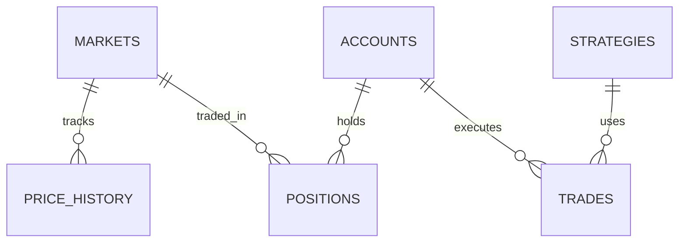

# PolyOMB - Polymarket 自动化交易与数据分析平台

[](https://www.python.org/downloads/)
[](https://www.postgresql.org/)
[](https://streamlit.io/)

> 🎯 面向预测市场的智能化数据分析与自动化交易解决方案

---

## 📖 项目简介

**PolyOMB** 是一个专注于 **Polymarket 预测市场** 的数据分析与自动化交易平台。

### 为什么选择 PolyOMB？

| 痛点 | 现有方案 | PolyOMB 解决方案 |
|------|---------|-----------------|
| API 数据不规整 | 手动处理 | 自动化数据获取与清洗 |
| 需要编程知识 | 代码导向 | 自然语言交互 + 可视化 |
| 策略难以管理 | 分散脚本 | Skill 式策略管理 |
| 无法测试策略 | 直接实盘 | 完整模拟交易环境 |
| 分析需求多变 | 固定报表 | 大模型驱动的自定义分析 |

---

## 🏗️ 系统架构

```
┌─────────────────────────────────────────────────────────────┐
│                      用户界面层                              │
│              Streamlit Web UI / Telegram Bot                │
└──────────────────────────┬──────────────────────────────────┘
                           │
┌──────────────────────────▼──────────────────────────────────┐
│                     业务逻辑层 - 6大模块                      │
│  ┌──────────┐ ┌──────────┐ ┌──────────┐ ┌──────────────────┐ │
│  │数据获取  │ │可视化分析│ │模拟交易  │ │真实交易(Phase 4) │ │
│  └──────────┘ └──────────┘ └──────────┘ └──────────────────┘ │
│  ┌──────────────────┐ ┌─────────────────────────────────────┐ │
│  │   策略管理器      │ │         大模型接口                   │ │
│  │ (Skill 系统)      │ │  (自然语言分析、自动数据协调)         │ │
│  └──────────────────┘ └─────────────────────────────────────┘ │
└──────────────────────────┬──────────────────────────────────┘
                           │
┌──────────────────────────▼──────────────────────────────────┐
│                       数据层                                 │
│         PostgreSQL (主存储)     Redis (缓存)                │
└─────────────────────────────────────────────────────────────┘
```

---

## ✨ 核心功能

### 1. 数据获取模块
- 📡 **Gamma API 集成**: 自动抓取 Polymarket 市场数据
- 🔄 **增量更新**: 只同步变化的数据，节省带宽
- 💾 **数据持久化**: 完整历史数据存储在 PostgreSQL
- 📊 **字段变更适配**: 自动处理 API 字段变化

### 2. 可视化分析模块
- 📈 **实时行情**: 价格走势、交易量、流动性
- 🔥 **热图生成**: 多市场对比、时间线可视化
- 🎨 **自定义图表**: 支持用户自定义分析维度
- 📋 **报告导出**: PDF、CSV、Parquet 格式

### 3. 模拟交易模块
- 💰 **虚拟账户**: 初始虚拟资金，无风险测试
- 📊 **策略回测**: 在历史数据上验证策略
- 📈 **P&L 跟踪**: 实时盈亏计算和分析
- 🔄 **多策略对比**: 并行测试多个策略

### 4. 策略管理器 (Skill 系统)

借鉴 OpenClaw 的 Skill 设计：

```yaml
---
name: momentum-strategy
description: "基于价格动量的交易策略"
metadata:
  polyomb:
    emoji: "📈"
    requires:
      data: ["price_history", "volume"]
    params:
      - name: "lookback_period"
        type: "int"
        default: 14
---
```

- 🧩 **插件化策略**: 策略即插件，易于安装和分享
- 🎛️ **参数配置**: 可视化策略参数调整
- 🏪 **策略市场**: 社区分享交易策略
- 🔒 **权限控制**: 策略运行权限管理

### 5. 大模型接口

**场景示例**：用户想分析"2025年政治类市场成功率时间线"

```
用户：我想查看2025年政治类市场，成功率从50%到100%的时间分布
    ↓
大模型接口分析需求
    ↓
检查数据库 → 数据缺失？→ 触发数据获取
    ↓
生成可视化代码
    ↓
展示热图结果
```

- 🤖 **自然语言分析**: 用自然语言描述分析需求
- 🔍 **自动数据协调**: 智能判断需要哪些数据
- 📊 **代码生成**: 自动生成可视化代码
- 💡 **智能建议**: 基于数据特征给出分析建议

---

## 🛠️ 技术栈

| 组件 | 技术选型 | 理由 |
|------|---------|------|
| **后端** | Python 3.11+ + FastAPI | 异步支持，性能优秀 |
| **数据库** | PostgreSQL 15+ | JSONB 支持，复杂查询 |
| **缓存** | Redis | 高频数据缓存，任务队列 |
| **可视化** | Streamlit + Plotly | 快速原型，交互性强 |
| **任务队列** | Celery + Redis | 异步数据处理 |
| **LLM 接口** | LiteLLM | 统一接口，多模型支持 |

---

## 📂 项目结构

```
项目根目录/
├── AGENTS.md                 # AI 助手规则
├── PROJECT.md                # 项目总体目标
├── README.md                 # 本文件
├── 
├── R0001 项目A-00019代码结构分析报告.md
├── R0002 项目B-OpenClaw Skill系统深度分析.md
├── R0003 项目C-PolyOMB数据库设计方案.md
├── R0004 项目D-开源预测市场工具调研报告.md
├── A0010 PolyOMB 项目讨论记录.md
├── polyomb_design_draft.md
│
├── CodeLib/00019/            # 现有代码资产
│   └── Polymarket Quantitative Trading/
│
└── CodeLib/00020/            # OpenClaw 源码参考
```

---

## 🚀 快速开始

### 环境要求

- Python 3.11+
- PostgreSQL 15+
- Redis 6+

### 安装步骤

```bash
# 1. 克隆仓库
git clone https://github.com/vERSAsONIC/polyomb.git
cd polyomb

# 2. 安装依赖
pip install -r requirements.txt

# 3. 配置环境变量
cp .env.example .env
# 编辑 .env 文件

# 4. 初始化数据库
python scripts/init_database.py

# 5. 启动服务
python -m polyomb
```

### 启动 Streamlit UI

```bash
streamlit run app/main.py
```

---

## 📊 数据库设计

核心表结构：



完整设计见：[R0003 项目C-PolyOMB数据库设计方案.md](./R0003%20项目C-PolyOMB数据库设计方案.md)

---

## 🎯 路线图

### Phase 1: 数据基础设施 (M1)
- [ ] Gamma API 客户端开发
- [ ] PostgreSQL 数据库搭建
- [ ] 基础数据可视化
- **时间**: 4-6周

### Phase 2: 分析与策略 (M2)
- [ ] 可视化分析模块
- [ ] 策略管理器基础版
- [ ] 模拟交易系统
- **时间**: 4-6周

### Phase 3: 智能化 (M3)
- [ ] 大模型接口集成
- [ ] 自定义分析功能
- [ ] 策略市场
- **时间**: 4-6周

### Phase 4: 生产就绪 (M4)
- [ ] 真实交易模块
- [ ] 性能优化
- [ ] 安全加固
- **时间**: 待定

---

## 📚 相关资源

### 开源参考
- [prediction-market-analysis](https://github.com/Jon-Becker/prediction-market-analysis) - 数据分析参考
- [Gnosis Prediction Market Agent](https://github.com/gnosis/prediction-market-agent) - AI 代理设计
- [OctoBot Prediction Market](https://github.com/Drakkar-Software/OctoBot-Prediction-Market) - 模拟交易参考
- [PolyClaw](https://github.com/chainstacklabs/polyclaw) - OpenClaw Skill 示例

### 工具清单
- [Awesome Prediction Market Tools](https://github.com/aarora4/Awesome-Prediction-Market-Tools) - 社区工具目录

### 数据集
- [Polymarket 36GB 数据集](https://github.com/Jon-Becker/prediction-market-analysis) - 历史和交易数据

---

## 🤝 贡献指南

欢迎贡献！请参考以下步骤：

1. Fork 本仓库
2. 创建功能分支 (`git checkout -b feature/AmazingFeature`)
3. 提交更改 (`git commit -m 'Add some AmazingFeature'`)
4. 推送到分支 (`git push origin feature/AmazingFeature`)
5. 创建 Pull Request

---

## ⚠️ 免责声明

**交易有风险，使用需谨慎。**

- 预测市场涉及资金损失风险
- 请在使用真实资金前充分测试策略
- 本项目仅供学习和研究使用
- 请遵守当地法律法规

---

## 📄 许可证

[MIT](LICENSE)

---

## 🙏 致谢

- [OpenClaw](https://github.com/openclaw) - Skill 系统设计参考
- [Jon Becker](https://github.com/Jon-Becker) - 数据集和数据分析框架
- [Gnosis](https://github.com/gnosis) - AI 代理框架参考

---

<p align="center">
  Made with ❤️ for the prediction market community
</p>
