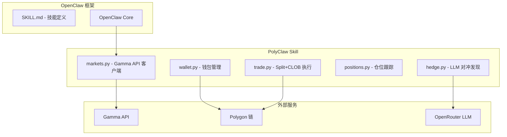
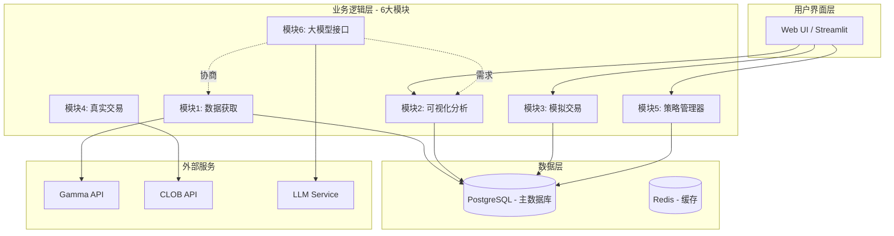
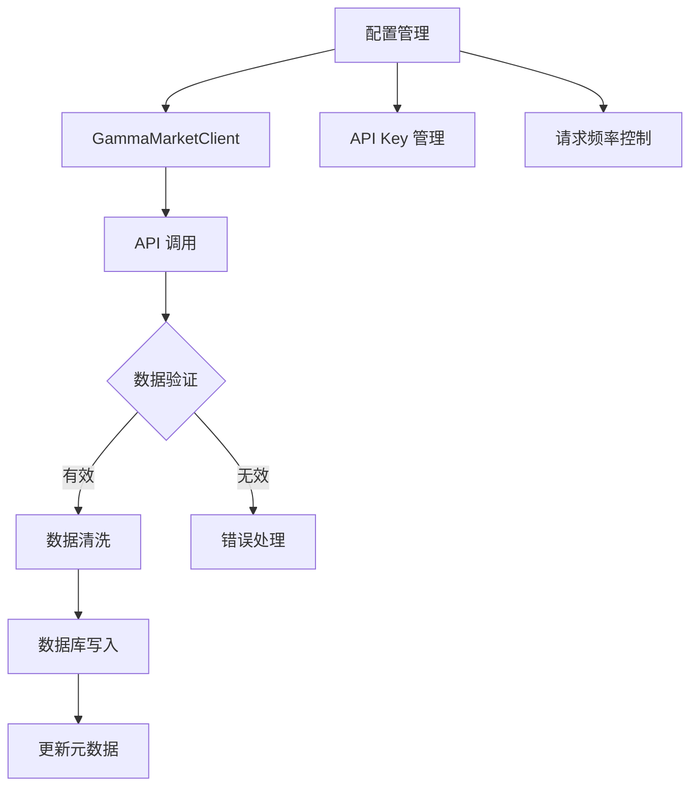
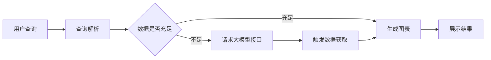
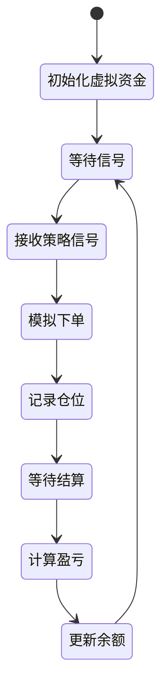
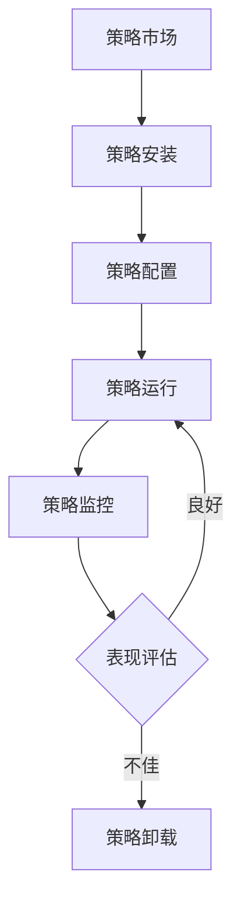
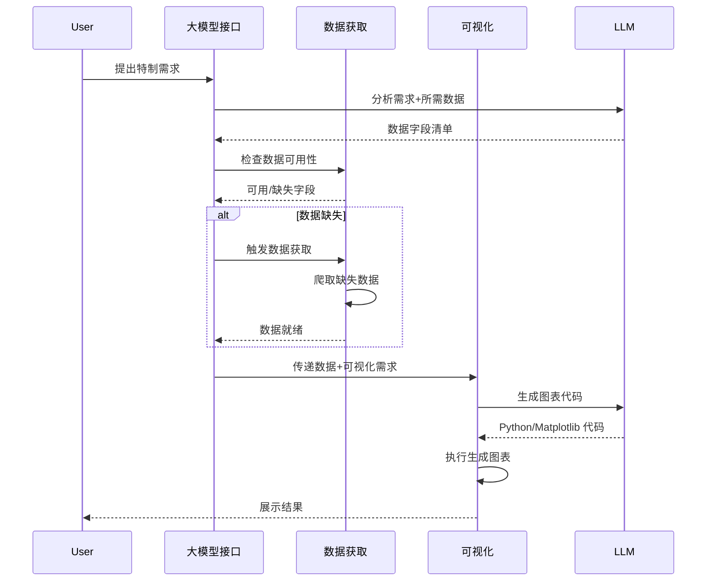
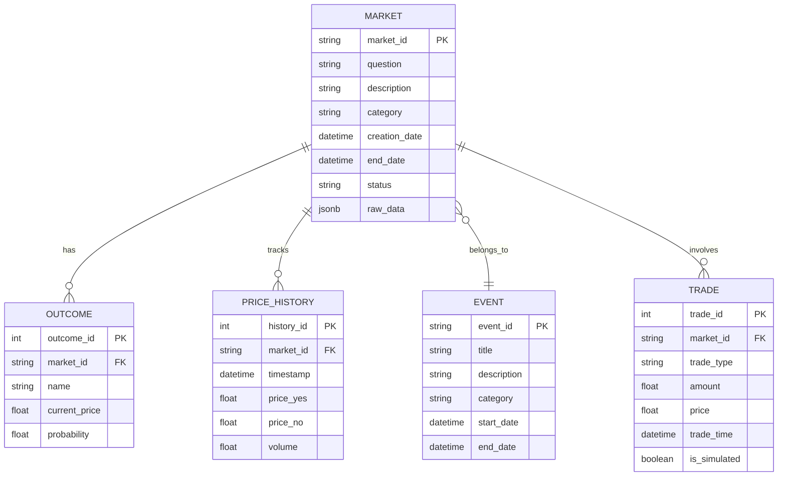

# PolyOMB 设计方案草案

## 一、需求理解

### 1.1 项目定位
**PolyOMB** = Polymarket 自动化交易 + 历史数据分析平台

### 1.2 目标用户
- 对预测市场感兴趣但不一定有代码基础的用户
- 需要可视化分析工具来理解市场规律
- 希望通过自动化策略进行交易

### 1.3 核心需求拆解

| 需求编号 | 需求描述 | 优先级 |
|---------|---------|--------|
| R1 | 从 Polymarket API 获取数据 | P0 |
| R2 | 数据持久化存储（数据库） | P0 |
| R3 | 可视化分析与图表展示 | P0 |
| R4 | 模拟交易与回测 | P1 |
| R5 | 真实交易执行 | P2 |
| R6 | 交易策略配置管理 | P1 |
| R7 | 大模型接口（灵活扩展能力） | P1 |
| R8 | 与 OpenClaw 类似的技能系统 | P2 |

### 1.4 特殊需求理解

**场景1：自定义可视化需求处理流程**
```
用户提出特制需求 
    ↓
大模型接口分析需求 → 确定所需数据字段
    ↓
检查现有数据库 → 缺失？
    ↓          ↓
  完整         与数据获取模块沟通
    ↓              ↓
数据获取模块执行爬取
    ↓
验证数据完整性
    ↓
可视化模块展示
```

---

## 二、参考案例调研

### 2.1 PolyClaw (GitHub: chainstacklabs/polyclaw)

**架构特点**：


**可借鉴之处**：
- ✅ 模块化的 Skill 设计
- ✅ 本地 JSON 文件存储仓位
- ✅ LLM 驱动的对冲发现
- ✅ CLI 命令行交互

**PolyOMB 差异化**：
- 更强大的数据持久化（数据库而非 JSON）
- 更灵活的可视化能力
- 模拟交易与回测系统

### 2.2 OpenClaw 架构参考

**核心机制**：
- 基于 `SKILL.md` 的技能定义
- Model-agnostic（支持本地 LLM 或云端）
- 网关架构连接多平台

**PolyOMB 可借鉴**：
- 插件化/技能化的策略管理
- 大模型与具体功能的松耦合

---

## 三、系统架构设计

### 3.1 整体架构



### 3.2 模块详细设计

#### 模块1：数据获取



**关键组件**：
- GammaMarketClient（参考现有代码）
- 数据库模型定义
- 增量更新机制
- 元数据追踪（API 字段变更）

#### 模块2：可视化分析



**场景1实现：政治类 Market 成功率时间线**
```
查询条件：
- Category = Politics
- Year = 2025
- Price progression 50% → 60% → 70% → 80% → 90% → 100%

可视化：
- 每个 Market 一条时间线
- 颜色分段：红橙黄绿青
- 长度按比例：按实际时间占比
- 排列：热图形式
```

#### 模块3：模拟交易



**核心功能**：
- 虚拟资金账户
- 模拟订单执行
- 仓位跟踪（参考 PolyClaw positions.py）
- P&L 计算
- 回测历史数据

#### 模块4：真实交易

**Deferred**：待模拟交易稳定后再实现

#### 模块5：策略管理器



**OpenClaw Skill 参考**：
- 策略以 Skill 形式存在
- SKILL.md 定义策略接口
- 统一的输入输出规范

#### 模块6：大模型接口



---

## 四、数据库设计概览

### 4.1 核心表结构



---

## 五、技术选型建议

| 组件 | 推荐方案 | 理由 |
|------|---------|------|
| 后端 | Python + FastAPI | 快速开发，异步支持 |
| 数据库 | PostgreSQL | JSONB 支持，复杂查询 |
| 缓存 | Redis | 高频数据缓存 |
| 可视化 | Streamlit / Plotly | 快速原型，交互性强 |
| 任务队列 | Celery + Redis | 异步数据处理 |
| LLM 接口 | LiteLLM | 统一接口，多模型支持 |

---

## 六、开发路线图

### Phase 1: MVP (4-6周)
- 模块1: 数据获取 + 数据库存储
- 模块2: 基础可视化
- 简单策略配置

### Phase 2: 核心功能 (4-6周)
- 模块3: 模拟交易
- 模块5: 策略管理器
- 基础回测

### Phase 3: 智能功能 (4-6周)
- 模块6: 大模型接口
- 高级可视化（场景1）
- 策略市场

### Phase 4: 生产就绪 (待定)
- 模块4: 真实交易
- 性能优化
- 安全加固

---

## 七、与 OpenClaw 的集成点

### 7.1 作为 OpenClaw Skill

PolyOMB 可以作为一个 Skill 被 OpenClaw 调用：

```
User: "帮我分析 2025 政治类市场"
    ↓
OpenClaw → PolyOMB Skill
    ↓
PolyOMB 执行分析 → 返回结果
```

### 7.2 策略即 Skill

交易策略可以以 OpenClaw Skill 形式存在：

```
skills/
├── strategy-momentum/      # 动量策略
├── strategy-mean-reversion/ # 均值回归
└── strategy-arbitrage/     # 套利策略
```

---

## 八、下一步建议

1. **确认数据库选型**：PostgreSQL 是否满意？
2. **细化模块1**：基于你现有的 Gamma API 代码，设计数据库模型
3. **UI 原型**：Streamlit 是否合适？
4. **需要 OpenClaw 源码**：你是否可以分享？以便更深入理解 Skill 系统

---

*本方案为初步设计，需进一步细化到可执行 Prompt*
